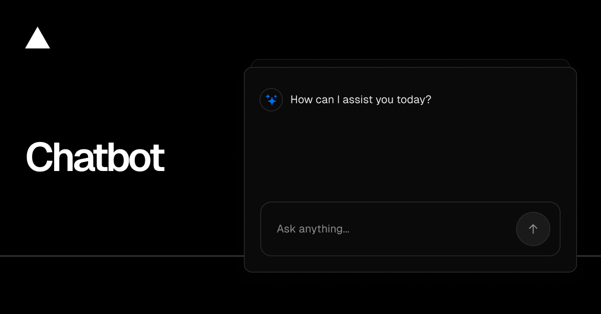

<a href="https://chatbot.ai-sdk.dev/demo">
  
  <h1 align="center">Chatbot</h1>
</a>

<p align="center">
    A Next.js chatbot powered by the pi SDK and DeepSeek API.
</p>

<p align="center">
  <a href="https://chatbot.ai-sdk.dev/docs"><strong>Read Docs</strong></a> ·
  <a href="#features"><strong>Features</strong></a> ·
  <a href="#model-providers"><strong>Model Providers</strong></a> ·
  <a href="#deploy-your-own"><strong>Deploy Your Own</strong></a> ·
  <a href="#running-locally"><strong>Running locally</strong></a>
</p>
<br/>

## Features

- [Next.js](https://nextjs.org) App Router
  - Advanced routing for seamless navigation and performance
  - React Server Components (RSCs) and Server Actions for server-side rendering and increased performance
- [pi SDK](https://github.com/earendil-works/pi)
  - Streams chat completions directly from DeepSeek
  - Supports `deepseek-flash` and `deepseek-v4-pro`
- [shadcn/ui](https://ui.shadcn.com)
  - Styling with [Tailwind CSS](https://tailwindcss.com)
  - Component primitives from [Radix UI](https://radix-ui.com) for accessibility and flexibility
- Data Persistence
  - [Neon Serverless Postgres](https://vercel.com/marketplace/neon) for saving chat history and user data
  - [Vercel Blob](https://vercel.com/storage/blob) for efficient file storage
- [Auth.js](https://authjs.dev)
  - Simple and secure authentication

## Model Providers

The chat and title-generation paths use [`@earendil-works/pi-ai`](https://github.com/earendil-works/pi/tree/main/packages/ai) to call DeepSeek's OpenAI-compatible endpoint directly. Models are configured in `lib/ai/models.ts`, and the pi adapter lives in `lib/ai/pi.ts`.

## Skills

The chat runtime uses `@earendil-works/pi-agent-core` for the Pi agent loop and supports project Skills stored as Agent Skills-compatible files under `.pi/skills/<name>/SKILL.md`.

- Create: ask the assistant to create or save a reusable Skill. It will validate the name and write the standard YAML frontmatter plus Markdown instructions.
- Automatic execution: when a request matches a discovered Skill description, the agent loads the full Skill on demand and follows it.
- Explicit execution: type `/` in the composer, select a Skill marked with `🔨` from the dynamic command menu, then send `/<name>` or `/<name> <task arguments>`.

Example:

```text
Create a reusable skill named weekly-recap that turns a weekly report into three concise bullets covering progress, risks, and next steps.

/weekly-recap Summarize this week's project update.
```

Skill creation writes to the application server's local filesystem. Use persistent storage for `.pi/skills` when deploying to an ephemeral or serverless runtime.

### DeepSeek Authentication

Set `DEEPSEEK_API_KEY` in `.env.local` for local development and in your deployment environment for production. The key is read on the server and is never sent to the browser.

## Deploy Your Own

You can deploy your own version of Chatbot to Vercel with one click:

[](https://vercel.com/templates/next.js/chatbot)

## Running locally

You will need to use the environment variables [defined in `.env.example`](.env.example) to run Chatbot. It's recommended you use [Vercel Environment Variables](https://vercel.com/docs/projects/environment-variables) for this, but a `.env` file is all that is necessary.

> Note: You should not commit your `.env` file or it will expose secrets that will allow others to control access to your various AI and authentication provider accounts.

1. Install Vercel CLI: `npm i -g vercel`
2. Link local instance with Vercel and GitHub accounts (creates `.vercel` directory): `vercel link`
3. Download your environment variables: `vercel env pull`

```bash
pnpm install
pnpm db:migrate # Setup database or apply latest database changes
pnpm dev
```

Your app template should now be running on [localhost:3000](http://localhost:3000).
