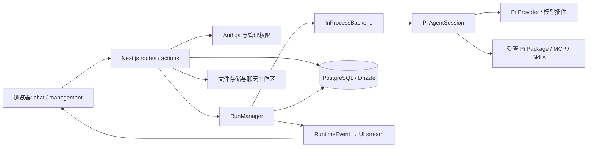

# Piwork 项目架构（当前实现）

> 核对日期：2026-09-27。依据当前工作树的代码和 `package.json`。Pi 三个主包 `@earendil-works/pi-ai`、`@earendil-works/pi-agent-core`、`@earendil-works/pi-coding-agent` 均为 **0.87.1**。本文描述现状；目标架构见 [Pi Package 与 Runtime 架构](pi-plugin-support-research.md)。

Web、独立 Worker/Sandbox 与未来 Desktop 的整体演进方向见 [平台与 Agent Runtime 演进架构](platform-runtime-roadmap.md)。

## 1. 系统边界

Piwork 是 Next.js 16 App Router 企业智能体平台。浏览器负责聊天、文件、Skill 与管理界面；Next.js 服务端负责身份鉴权、管理权限、会话编排、Pi 会话宿主、流转发和持久化；PostgreSQL/Drizzle 保存用户、组织、聊天、运行事件和管理配置。模型能力由 Pi Provider 提供，前端通过 AI SDK UI message stream 消费结果。文件可写入 Vercel Blob 或本地存储，聊天执行工作区位于 `.pi/workspace/<chatId>`，受管 Pi 包位于 `.piwork/pi-agent`。

## 2. 代码目录与职责

| 目录 | 职责与主要入口 |
| --- | --- |
| `app/(auth)` | Auth.js、访客登录、注册与鉴权动作 |
| `app/(chat)` | 聊天页、聊天/文档/上传/模型/Skill API；`api/chat/route.ts` 是请求入口，`stream-mapping.ts` 负责协议到 UI stream 的映射 |
| `app/(management)` | 组织、成员、角色、模型插件、Pi Package、MCP、Skill 的管理页与 API |
| `components/chat`、`components/management`、`components/ui`、`hooks` | 页面组合、业务组件、基础组件和前端状态/hooks |
| `lib/runtime/protocol` | 平台内的 `RuntimeSpec`、命令、事件、`RuntimeBackend`/`RuntimeSession` 契约；服务端适配器和上层编排的边界 |
| `lib/runtime/backends` | `in-process` 当前运行适配器；`local-rpc` 是已实现的本机子进程适配器，尚未接入生产默认路径；Pi 事件归一化和事件队列 |
| `lib/runtime/run` | `RunManager` 生命周期、订阅、事件日志、消息构建、事件存储接口；`index.ts` 组装当前后端和 PostgreSQL 实现 |
| `lib/ai` | Pi session 装配、模型适配、系统提示、Skill、工具、附件和文件存储；`agent-session.ts` 调用 Pi SDK |
| `lib/pi-packages`、`lib/mcp` | 受管 Pi 包安装/资源清点；将管理端 MCP 配置同步到聊天工作区 `.mcp.json` |
| `lib/model-plugins`、`packages/model-provider-sdk`、`plugins` | 模型供应商插件契约、检查/构建/Worker host/注册；SDK 与示例 DeepSeek 插件 |
| `lib/db`、`lib/management` | Drizzle schema、迁移和查询；管理权限与管理业务逻辑 |
| `lib/artifacts`、`lib/editor`、`i18n` | 文档产物、编辑器功能和国际化 |
| `tests`、`scripts` | 单元/集成/E2E 测试与构建、验证脚本；目录细节见 [开发与测试](development.md) |

## 3. 聊天运行链路

逐步时序图和 RPC 边界见 [聊天业务链路与 RPC](rpc-business-flow.md)。

1. `app/(chat)/api/chat/route.ts` 校验请求、身份、配额及模型目录；读取/保存聊天消息，处理附件，加载启用的 Skill，并按聊天创建工作区和 `.mcp.json`。
2. 请求将模型、历史、提示、工具和工作区组成 `RuntimeSpec`，交给 `getRunManager().start()`；页面流订阅运行事件。断线重连走 `api/chat/[id]/stream`，显式停止走 `api/chat/[id]/stop`。
3. `lib/runtime/run/index.ts` 当前固定装配 `InProcessBackend`。后端通过 `lib/ai/agent-session.ts` 创建 Pi `AgentSession`，使用 `DefaultResourceLoader`、`ModelRuntime`、`SessionManager.inMemory()` 和自定义工具。Pi 的 agent loop、工具执行与扩展生命周期由 Pi SDK 掌管。
4. Pi 事件由 `lib/runtime/backends/pi-event-normalizer.ts` 转为平台 `RuntimeEvent`。`RunManager` 管理运行状态、事件序号、订阅与重放；关键事件写入 `RuntimeEvent` 表，最终 assistant 消息落库。`stream-mapping.ts` 才把平台事件转成前端 UI message stream。

**边界约束**：路由不直接依赖某个 Pi 事件格式；前端不直接消费 Pi SDK/RPC 事件。`RuntimeSpec` 目前仍含 Pi 类型，是服务端内部契约；不要将其宣称为可跨进程序列化的通用 DTO。数据库聊天历史重建为 Pi 会话消息，不能等同于 Pi 原生持久会话的完整状态。

## 4. 管理与资源链路

- **身份与权限**：`app/(auth)` 提供用户会话；管理 API 通过 `lib/management/access.ts` 判定管理身份。新增管理操作需沿用这一入口。
- **数据**：`lib/db/schema.ts` 定义用户、组织、成员/角色、聊天/消息、文档、Skill、模型插件、MCP、Pi Package、AgentRun/RuntimeEvent/RuntimeLease；查询由 `lib/db/*-queries.ts` 持有，路由不直接拼 SQL。
- **模型**：`lib/model-plugins` 检查并构建插件，在 Worker 中激活，暴露 Pi `Provider`；`lib/ai/pi.ts` 和 `agent-session.ts` 将可用 Provider 接入 Pi 模型运行时。`plugins/piwork-llm-deepseek` 是项目内示例插件。
- **Package 与 Skill**：`lib/pi-packages/manager.ts` 使用 Pi `DefaultPackageManager.installAndPersist()` 管理受管目录；包内 Skill 由 Piwork 的 Skill 管线登记、启用和展示。聊天会话通过 `DefaultResourceLoader` 加载受管扩展，同时关闭全局 Skill/上下文自动发现，避免跨租户资源泄漏。
- **MCP**：管理端记录服务配置，`lib/mcp/workspace-config.ts` 在请求时生成工作区 `.mcp.json`；系统 Pi Package `pi-mcp-adapter` 负责消费它。

## 5. 现状与目标的分界

| 能力 | 当前状态 |
| --- | --- |
| Pi SDK 会话、受管 Package、模型 Provider 桥接 | 已接入当前聊天路径 |
| InProcessBackend + RunManager + PostgreSQL 事件/消息持久化 | 当前默认路径 |
| LocalRpcBackend | 已有实现与契约测试；生产组装尚未选用 |
| 完整 Pi 进程 Sandbox、远端 Runtime Worker、隔离后的生产 RPC | 目标设计，当前代码未落地 |
| 用户上传扩展/模型插件的强隔离与凭据网关 | 安全规划；现有 Worker 与进程内扩展不应被描述为强沙箱 |

## 6. Pi 官方依据

- [SDK](https://pi.dev/docs/latest/sdk)：`createAgentSession`、`SessionManager`、`DefaultResourceLoader`、订阅事件及 `dispose()`；本项目会话装配与运行生命周期按这些边界处理。
- [RPC 协议](https://pi.dev/docs/latest/rpc) 与 [RPC 命令](https://pi.dev/docs/latest/rpc-commands)：本机 RPC 适配器的命令、事件和进程生命周期依据。
- [Extensions](https://pi.dev/docs/latest/extensions)、[Custom Providers](https://pi.dev/docs/latest/custom-provider)：扩展工厂、`registerProvider()` 与 Provider 接口的依据。
- [Pi Packages](https://pi.dev/docs/latest/packages)、[Skills](https://pi.dev/docs/latest/skills)：安装与资源发现约定的依据。
- 精确签名与行为以本仓库安装的 `node_modules/@earendil-works/pi-coding-agent`、`pi-ai`、`pi-agent-core` **0.87.1** 类型/源码为准；文档 latest 可能超前于已安装版本。

## 7. 我的文档（2026-09-28）

- `/documents` 提供文件夹、全局文件名搜索、分类、AI 来源筛选、网格/列表、图片预览、下载、重命名、文件移动和 Markdown 笔记。`components/documents` 是客户端界面，`lib/documents` 仅包含共享类型及展示函数。
- `LibraryItem` 保存用户归属、父文件夹、来源、MIME、大小与存储引用；访问通过 `lib/db/library-queries.ts` 按 userId 校验。文件夹是逻辑目录，物理字节继续由 `lib/ai/file-store.ts` 存到 `.uploads`/`UPLOAD_DIR` 或既有 Vercel Blob。
- `/api/files/upload` 的聊天上传仍保留附件格式限制；文档库上传支持任意扩展名、单文件 20 MB，未知类型强制下载。两个入口均归档。`/api/library` 负责目录查询/创建，`/api/library/[id]` 负责受保护下载、重命名和文件移动；本地 `/api/files/[id]` 和聊天提交的本地附件同步校验归属，防止绕过下载路由通过 AI 读取其他用户文件。栅格图片通过鉴权路由预览，HTML/SVG 等主动内容作为附件下载。
- 生产 `lib/runtime/run/index.ts` 向 `InProcessBackend` 注入 `registerGeneratedFile`；backend 将它交给现有 Pi `deliver_file` 工具的异步 `onStored` 回调。归档成功后才发出原有 `artifact.created`，不改变 RuntimeEvent 协议或 Pi agent loop。通用工具/后端契约测试无需连接数据库。LocalRpc 尚未支持这个平台工具桥接。
- `saveDocument` 与文档目录登记在同一事务内；更新内容同步大小和更新时间。下载读取最新 Document 版本。迁移 `0010` 回填已有 Document 及 Message_v2 中的上传和交付附件；没有聊天引用的旧磁盘文件无法可靠推断归属，不自动认领。历史聊天附件大小未知时显示“—”。
- 已配置的 Vercel Blob 仍沿用原有 public 对象模式；文档库目录/API 按用户隔离，不等同于将已有 Blob URL 改成私有对象。当前未提供 Office 在线编辑、Office 页面缩略图、回收站或项目权限管理。工作区中间文件不归档，最终产物通过 `deliver_file` 归档。
- Pi 依据：[SDK customTools](https://pi.dev/docs/latest/sdk)、[Extensions 工具契约](https://pi.dev/docs/latest/extensions)；已安装 **0.87.1** 的 `dist/core/sdk.d.ts` 与 `dist/core/extensions/types.d.ts`（ToolDefinition.execute）核对了自定义工具的异步执行和结果返回方式。
