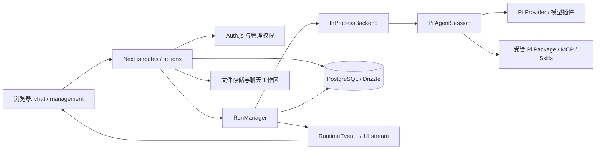

# Piwork 项目架构（当前实现）

> 核对日期：2026-10-02。依据当前工作树的代码和 `package.json`。本轮升级后的 Pi 主包、Pi Durable 与 chord 均为 **1.0.3**；Durable 仍 experimental。本文描述现状；目标架构见 [Pi Package 与 Runtime 架构](pi-plugin-support-research.md)。

Web、独立 Worker/Sandbox 与未来 Desktop 的整体演进方向见 [平台与 Agent Runtime 演进架构](platform-runtime-roadmap.md)。最新实施基线见 [千人企业 MVP 与沙箱执行面实施方案](sandbox-execution-surface-design.md)：目标为工具级沙箱 → 单 Worker → 受控 Durable 车道。**执行路径改造尚未接入生产**；RunDescriptor/ExecutionState、LazySandbox、操作错误分类、限额/原子文件能力与四工具工厂已落地；已实现 SandboxToolsBackend 协议适配器、私有制品存储与交付回调，Docker 新契约已通过，生产接线与治理尚未完成，见 [实施记录](runtime-foundation-implementation.md)。现状中的 RPC、Next.js 内 RunManager、Docker 无 reaper 保持不变；Durable 新增 SQLite/单写者/恢复阻断基础，生产默认 MemoryStorage 路径已明确拒绝，但正式 Worker 接线仍未完成。

本轮新增 [Durable + Sandbox 受控组合](durable-sandbox-composition.md)：`DurableSandboxBackend` 复用官方 Harness/私有 owned SQLite 与现有 lazy 四工具，已通过真实 OpenSandbox 功能契约；fresh-run、单 prompt、deny-all、非生产显式探针。执行映射存官方 document；终态前回收，清理失败保留归属。**已接非生产自动聊天分流：开发环境所有正式启用成员无需勾选，test 保留 UUID 白名单；未启用时默认矩阵不变，Worker/自动恢复不变**；全局 env 互斥仍保留，现有 SandboxToolsBackend 的 OpenSandbox 拒绝门禁不变。`/api/chat/runtime-options` 仅保留能力查询，UI 不选择后端；分类不是授权；正式 DB 授权、水合/私有归档在服务端装配，实际后端落 `AgentRun.backend=durable_sandbox`（varchar，仅扩 TS 值域，无 SQL enum/迁移）。

## 1. 系统边界

Piwork 是 Next.js 16 App Router 企业智能体平台。浏览器负责聊天、文件、Skill 与管理界面；Next.js 服务端负责身份鉴权、管理权限、会话编排、Pi 会话宿主、流转发和持久化；PostgreSQL/Drizzle 保存用户、组织、聊天、运行事件和管理配置。模型能力由 Pi Provider 提供，前端通过 AI SDK UI message stream 消费结果。文件可写入 Vercel Blob 或本地存储，聊天执行工作区位于 `.pi/workspace/<chatId>`，受管 Pi 包位于 `.piwork/pi-agent`。

### 控制面与 Runtime 状态的存储分工

- **PostgreSQL（控制面 System of Record）**：身份/组织/RBAC、Skill/MCP/模型配置、平台任务与运行归属、审计和用量/消息/产物投影。
- **Pi Durable + 私有 SQLite（Runtime execution state）**：官方 transcript/inbox/task/checkpoint/工具执行状态。按运行绑定隔离并保持单 Writer；不把每个内部 checkpoint 转写为 PostgreSQL 业务表。
- **私有文件/对象存储**：用户输入字节、交付制品与大型日志；归属和引用仍登记 PostgreSQL。

本轮 PostgreSQL Storage 尝试已撤回；本地新增空表 DurableSession/DurableCommit 与对应两条迁移记录也已事务回滚，原业务表不变。1.0.2 升级及 registry.install/defineExtension/conversation.configure API 适配保留。Cloudflare DO 的 Actor 生命周期、Alarm 和 PITR 只作设计借鉴：本项目仍是 Node/Next.js，尚无这些部署能力。SQLite 上生产仍需可靠私有持久卷、单 Writer 与进程/工作区所有权、备份及恢复演练、Worker 唤醒和未知副作用对账；不承诺千人并发容量。

## 2. 代码目录与职责

| 目录 | 职责与主要入口 |
| --- | --- |
| `app/(auth)` | Auth.js、正式账号登录、注册与鉴权动作（访客已关闭） |
| `app/(account)/settings`、`components/profile` | 个人设置页与账户动作：资料编辑、密码修改、本人任务统计 |
| `app/(chat)` | 聊天页、聊天/文档/上传/模型/Skill API；`api/chat/route.ts` 是请求入口，`stream-mapping.ts` 负责协议到 UI stream 的映射 |
| `app/(admin)` | 组织、成员、角色、模型插件、Pi Package、MCP、Skill、沙箱的管理页与 API |
| `components/chat`、`components/admin`、`components/ui`、`hooks` | 页面组合、业务组件、基础组件和前端状态/hooks |
| `lib/runtime/protocol` | 平台内的 `RuntimeSpec`、命令、事件、`RuntimeBackend`/`RuntimeSession` 契约；RuntimeSpec 的 durableChat 是宿主 reference-only 授权输入（无附件字节/闭包），仍非 Worker DTO；新增 P0 `RunDescriptor` 严格 JSON 契约与独立 `ExecutionState` 转换检查，尚未接入 job/DB/路由 |
| `lib/runtime/backends` | `in-process` 当前运行适配器；`local-rpc` 是已实现的本机子进程适配器，尚未接入生产默认路径；`sandbox-rpc` 把官方 `RpcClient` 经 bridge 泵接进沙箱内 pi，含 Artifact Gateway（deliver_file 出站）与 Inference Proxy 客户端装配（models.json/run token/egress 派生）；`routing` 按 v2.0 §8.1 矩阵逐 run 分流（执行工具 → 沙箱、纯对话 → in-process）；经 `PIWORK_SANDBOX_PROVIDER=docker\|opensandbox` 装配（默认关闭）；Pi 事件归一化和事件队列。新增 `sandbox-tools` 已实现 RuntimeBackend（复用 InProcessRuntimeSession/官方 SDK、资源回收后终结、未知结果/授权失败强制失败），可注入私有交付；尚未接入生产路由/DB backend 枚举 |
| `lib/runtime/inference-proxy` | 控制面旁路 HTTP 反代（pi-messages wire 协议）：`server.ts`（鉴权/SSE 中继/审计）、`tokens.ts`（AgentRun 级短期窄 token）、`models-manifest.ts`（沙箱 agentDir models.json 生成）、`events.ts`（AssistantMessageEvent → SSE 行映射）；真实模型凭据只在本层内侧（模型插件 Worker host） |
| `lib/runtime/sandbox` | Pi 无关的 `SandboxProvider`/`SandboxHandle`/`SandboxChannel` seam、DB 注册表/租约、UDS bridge 泵与 shim、`docker/` CLI provider（安全基线自持，egress 默认 deny-all / allowlist 网桥近似）与 `opensandbox/` 生产 provider（SDK 隔离在该目录）；新增可选 `SandboxHandle.filesystem` 能力（Linux 固定 Node helper、限额/stat/原子写）与 `readCombined`（RPC stdout 不变），旧 RPC 文件 API 不变；详见 [OpenSandbox 接入 Spec](opensandbox-integration-spec.md) |
| `lib/runtime/run` | `RunManager` 生命周期、订阅、事件日志、消息构建、事件存储接口；`index.ts` 组装当前后端和 PostgreSQL 实现 |
| `lib/ai` | Pi session 装配、模型适配、系统提示、Skill、工具、附件和文件存储；`agent-session.ts` 调用 Pi SDK |
| `lib/search` | 可信平台联网搜索 Gateway、固定 Tavily API、逐次正式身份/聊天/模型授权、单进程准入及有界来源投影；不运行第三方插件或抓取任意网页 |
| `lib/collab` | 聊天协作实时事件 hub（进程内 pub/sub）：SSE 房间/presence/typing TTL、消息与 run 生命周期通知；事件不携带正文，真相在 PostgreSQL；单实例前提，多副本需外部总线，见 [对话分享与协作](chat-collaboration.md) |
| `lib/pi-packages`、`lib/mcp` | 受管 Pi 包安装/资源清点；将管理端 MCP 配置同步到受管 agentDir `mcp.json`，并提供 Pi 内置 MCP 扩展的自定义 `loadConfig` |
| `lib/model-plugins`、`packages/model-provider-sdk`、`plugins` | 模型供应商插件契约、检查/构建/Worker host/注册；SDK 与示例 DeepSeek 插件 |
| `lib/db`、`lib/admin` | Drizzle schema、迁移和查询；管理权限与管理业务逻辑 |
| `docker/` | 沙箱运行时镜像（`pi-runtime`：预装完整 pi，供 SandboxRpcBackend 的 `remoteCliPath` 指向） |
| `lib/artifacts`、`lib/editor`、`i18n` | 文档产物、编辑器功能和国际化 |
| `tests`、`scripts` | 单元/集成/E2E 测试与构建、验证脚本；目录细节见 [开发与测试](development.md) |

### PostgreSQL 连接生命周期

所有应用查询复用 `lib/db/client.ts` 的 `getDb()`。按连接 URL + 时钟档缓存于进程 globalThis，跨 Next 路由 bundle/开发 HMR 复用；默认池最多 5 个连接，沙箱 UTC 池最多 2 个，空闲 20 秒释放。默认池不覆盖数据库 TimeZone，沙箱仍显式 UTC；迁移保留独立单连接。边界为单进程/单配置，多个进程和测试数据库 URL 仍各自占用额度；旧模块创建的池需重启开发服务释放，不通过杀其他应用连接解决。未改 Pi SDK、Durable SQLite 或运行状态持久化。

## 3. 聊天运行链路

逐步时序图和 RPC 边界见 [聊天业务链路与 RPC](rpc-business-flow.md)。

1. `app/(chat)/api/chat/route.ts` 校验请求、身份、配额及模型目录；读取/保存聊天消息，处理附件，加载启用的 Skill，按聊天创建工作区，并把启用的 MCP 服务同步进受管 agentDir 的 `mcp.json`。
2. 请求将模型、历史、提示、工具和工作区组成 `RuntimeSpec`，交给 `getRunManager().start()`；页面流订阅运行事件。断线重连走 `api/chat/[id]/stream`，显式停止走 `api/chat/[id]/stop`。
3. `lib/runtime/run/index.ts` 默认装配 `InProcessBackend`（未设 `PIWORK_SANDBOX_PROVIDER` 时）；设置了 provider 则按路由矩阵分流（执行工具 run → SandboxRpc、纯对话 → InProcess，`PIWORK_SANDBOX_ROUTING=matrix` 默认/`all`）。InProcess 后端通过 `lib/ai/agent-session.ts` 创建 Pi `AgentSession`，使用 `DefaultResourceLoader`、`ModelRuntime`、`SessionManager.inMemory()` 和自定义工具。Pi 的 agent loop、工具执行与扩展生命周期由 Pi SDK 掌管。
4. 沙箱 argv 派生显式使用配置的 remoteCliPath，不调用宿主 `import.meta.resolve`（Next.js Turbopack 不支持）；宿主仍由官方 RpcClient 经 bridge shim 启动。backend.open 失败由 RunManager 记录 failed 与真实错误并释放 lease，避免遗留 queued；聊天流错误在服务端记录，客户端保持通用提示。
启动期生命周期：RunManager 在首次 await 前预留 chat；DB 创建/lease 发布与僵尸清理经短临界区串行，backend.open 不持锁。已获 lease 的 run 进入 starting，启动中映射与 LiveRun 一并受排除/心跳保护，交接不留空窗。未知但持 lease 的 run 仅在心跳过期时失败，无 lease 的孤儿可清理；DB 用单条条件 UPDATE 检查非终态/清理条件，并在事务内仅释放实际更新行的 lease，不覆盖正常终态。仍是单进程 MVP，不是完整 Worker/fencing 或自动恢复。

5. Pi 事件由 `lib/runtime/backends/pi-event-normalizer.ts` 转为平台 `RuntimeEvent`。`RunManager` 管理运行状态、事件序号、订阅与重放；关键事件写入 `RuntimeEvent` 表，最终 assistant 消息落库。`stream-mapping.ts` 才把平台事件转成前端 UI message stream。落库后的用户消息与终态 assistant 消息同时向 `lib/collab` 的进程内协作 hub 发通知（事件不携带正文）：其他成员的浏览器经 `/api/chat/[id]/events` SSE 收到后重拉 `/api/messages` 或 `resumeStream` attach 活跃 run，实现共享对话的实时互见；单实例进程内广播，非跨副本能力。

服务端自动分流在原职责链上追加（class 名称中的 Explicit 指服务端选定的内部 lane，不是用户勾选）：`route → RunManager → ExplicitDurableRuntimeBackend → DurableChatBackend → 官方 Harness/owned SQLite → LazySandbox/filesystem`。只有一套 agent loop，宿主模型凭据/SQLite 不进入沙箱。`run/durable-chat.ts` 注入 `db/durable-chat-queries.ts` 的正式 enabled/归属/运行状态检查及启用模型目录复核，prompt/hash/配置绑定，工具执行前复核；目录缓存沿用最多 30 秒。附件是本人 LibraryItem 引用，最多 5 个/每个 20 MB/总计 50 MB，图像累计 8 MB；不在宿主解析 Office/图片。原始字节使用有界下载与 hash/size 复核，通过原子 filesystem 水合到相对 inputs 路径；授权/水合失败必须回收，不忽略附件或回退宿主。私有交付先保存并登记本人 LibraryItem，再经 RuntimeEvent 发文件。每条新消息是新 run/新工作区，仅复用文本历史；没有跨进程平台闭包支持。

Stop 命令受理不等于干净取消；正在执行的 shell 若效果未知可能落 failed，不能重写为 settled/aborted，仍 kill/核验、不重放。Leasing release 通过 WeakMap 把本层 wrapper 解包为原 provider handle，保持严格 provider 的归属校验与单次记账。HTTP fixture 在唯一 PG schema 隔离平台表、独立 build/tsconfig 和私有 SQLite；不把 Runtime checkpoint 改存 PG，也不把功能测试当 UI/恢复/容量证明。

**边界约束**：路由不直接依赖某个 Pi 事件格式；前端不直接消费 Pi SDK/RPC 事件。`RuntimeSpec` 目前仍含 Pi 类型，是服务端内部契约；不要将其宣称为可跨进程序列化的通用 DTO。数据库聊天历史重建为 Pi 会话消息，不能等同于 Pi 原生持久会话的完整状态。

## 4. 管理与资源链路

- **身份与权限**：`app/(auth)` 提供用户会话；管理 API 通过 `lib/admin/access.ts` 判定管理身份。新增管理操作需沿用这一入口。
- **数据**：`lib/db/schema.ts` 定义用户、组织、成员/角色、聊天/消息、文档、Skill、模型插件、MCP、Pi Package、AgentRun/RuntimeEvent/RuntimeLease；查询由 `lib/db/*-queries.ts` 持有，路由不直接拼 SQL。
- **模型**：`lib/model-plugins` 检查并构建插件，在 Worker 中激活，暴露 Pi `Provider`；`lib/ai/pi.ts` 和 `agent-session.ts` 将可用 Provider 接入 Pi 模型运行时。`plugins/piwork-llm-deepseek` 是项目内示例插件。
- **Package 与 Skill**：`lib/pi-packages/manager.ts` 使用 Pi `DefaultPackageManager.installAndPersist()` 管理受管目录；包内 Skill 由 Piwork 的 Skill 管线登记、启用和展示。聊天会话通过 `DefaultResourceLoader` 加载受管扩展，同时关闭全局 Skill/上下文自动发现，避免跨租户资源泄漏。旧系统插件 `pi-mcp-adapter` 已被 Pi 内置 MCP 取代，进程内会自动退役清理（见第 10 节）。
- **MCP**：管理端记录服务配置，`lib/mcp/agent-config.ts` 在请求时把启用服务（`exposure: direct`）同步到受管 agentDir 的 `mcp.json`；Pi 内置 MCP 扩展以自定义 `loadConfig` 消费它，忽略工作区项目级配置。
- **管理概览（2026-10-03）**：`/admin` 首页由服务端预取 `getAdminOverview()` 并传给客户端组件，手动刷新走 `GET /api/admin/overview`（仅管理员，只读，页面另有 `requireAdminRole` 占位）；聚合查询在 `lib/db/overview-queries.ts`，payload 组装与系统服务状态在 `lib/admin/overview.ts`。指标口径：「任务」= AgentRun（不含 ScheduledTaskRun），成功率 = settled / (settled + failed + aborted)（近 30 天，含上一窗口对比），活跃用户 = 窗口内有 run 的去重用户；趋势为近 30 天按日 settled/failed/aborted（SQL `generate_series` 补零，按数据库会话时区自然日，与 agent-run-queries 的写入时钟一致）；另含后端分布（in_process/sandbox_rpc）、最近 run（联 Chat 标题与 User 名）、最近 Skill（按 updatedAt，平台无使用计数）、五源合并动态（Skill/MCP/成员/沙箱/定时任务）与服务状态（数据库连通、启用模型插件健康聚合、定时任务与沙箱装配开关——沙箱实例实时状态仍归 /admin/sandboxes）。任何聚合查询失败整体 500，不输出部分结果。**时区口径**：输出 ISO 前在 SQL 内按各表写入时钟显式转 timestamptz——`now()` 经默认连接写入的表（AgentRun/Member/ScheduledTask.createdAt）按 `current_setting('TimeZone')` 解释，UTC 墙钟写入的表（Skill/McpServer 的 updatedAt、SandboxInstance.createdAt 经显式 UTC 连接）按 UTC 解释；不转换时服务端进程时区（如 UTC）与库会话时区（Asia/Shanghai）不一致会产生 ±8h 偏移。

### 角色工作台、模型权限与 Token 额度

`/admin/organization?view=permissions` 使用左侧可搜索角色列表、右侧详情，依次为成员管理、模型权限、Token 额度；成员仍复用原选择/移除接口。`Role.modelPolicy/tokenPolicy`（迁移 0018）为可空 JSON：null 保持原平台行为，恢复默认清除独立策略。管理员策略接口 `/api/admin/roles/:id/policies` 校验正式管理员、UUID、schema、默认模型与平台可用目录；系统角色仅名称/描述锁定，策略可配置。

模型目录复用 `getActiveModelCatalog` 与现有 Pi Provider/复合 ID，不返回凭据。多角色按已配置角色授权并集，未配置角色不覆盖显式限制；关闭切换仅授予该角色默认模型（其他角色仍可授予更多），无已配置角色沿用平台目录。默认按角色 createdAt/id 顺序选首个可用默认；供应商禁用/卸载仅取与当前目录交集。`/api/models` 正式身份、成员启用检查及 no-store；chat 拒绝越权模型，不静默回落；标题和定时任务使用成员目录。生产 RunManager 注入 `authorizeStart` 在 DB 建 run/lease/backend.open 之前、短临界区之外复核身份/模型/额度；`checkRecordedQuota` 在 message.completed 落库后复核，超额请求官方 abort 并以 failed 收尾。通用 RunManager 不依赖 DB，测试可注入回调；HMR 旧 manager 需服务重启。

额度按当前角色全部成员已保留 `message.completed.usage.totalTokens` 汇总（共享角色额度），每日/月按默认数据库自然日/每月 1 日窗口；单任务按同 run 全部完成消息。多角色任一 block 超额即拒绝，warn 仅服务端日志。缺少用量显示缺口，不重复缓存/推理、不计标题/分类/嵌套工具；成员移动和聊天删除会改变统计，不是历史账本。新任务准入与完成消息后复核**不是预留/硬预算**，在途、同一 run 已调度的后续操作和并发请求可超支；不能宣称零超支、工具副作用可撤回、动态撤权可即时打断现有调用或强配额计费能力。未知 shell 效果仍由原后端清理，不重放。官方依据：Pi 1.0.2 `docs/models.md`、`docs/custom-provider.md` 与 `pi-ai/dist/models.d.ts` 的 Provider 模型目录契约、`pi-ai/dist/types.d.ts` Usage；未新增模型协议或第二个 agent loop。

### 管理端对话记录

`/admin/conversations` 与 `/api/admin/conversations[/<id>]` 仅 enabled/admin 成员可读；侧边栏「记录与统计 → 对话记录」。`components/admin/conversations` 复用后台组件与主题，提供真实 Chat 列表、标题/用户/项目检索、项目/最近运行状态/UTC 更新时间筛选、排序、分页、详情和只读消息文本分页。查询归 `lib/db/conversation-queries.ts`，只读 repeatable-read 保持计数与页内数据一致；共享校验与文本投影归 `lib/admin/conversations.ts`。不读 Pi JSONL/私有 SQLite，不启动或重建会话，不改变普通聊天所有权。模型已补运行级请求快照（AgentRun.requestedModel，迁移 0017）与完成事件实际模型（SDK/RPC 与 Durable 两类归一化器）；按 run 优先实际 model/responseModel，其次请求快照，最后同 run/chat 的 allowed 推理审计证据，保留跨轮模型切换并支持筛选。供应商展示按已记录 provider 精确关联 ModelProviderPlugin 的公开 displayName/providerKey，列表/详情/筛选复用包内 Logo API，不显示内部 installation ID；未知/卸载与图标失败保守回退，不用当前模型目录覆盖历史模型身份。Token 按会话全部持久化 message.completed.usage 聚合五字段，官方 totalTokens 不重复加 reasoning/缓存；缺失显示未记录/部分记录，不与代理审计 Token 重复累计，不含分类/标题/压缩/工具嵌套费用。不虚构归档状态。完整链路与口径见 [对话模型与用量](conversation-model-usage.md)。仅投影 Message_v2 的 text parts，排除 reasoning/工具参数/结果/附件地址；这不是 Pi 完整 transcript 或不可变审计账本，删除聊天会删除相关记录。官方依据：Pi 1.0.2 `docs/sdk.md`、`docs/message-types.md`、`docs/session-format.md`（平台历史投影与 Pi 原生会话树不同）。

### 管理端 Token 统计

`/admin/token-statistics` 与 `GET /api/admin/token-statistics` 仅 enabled/admin 可读，侧栏归「记录与统计」。`lib/db/token-statistics-queries.ts` 使用共享 getDb/read-only repeatable-read，按 RuntimeEvent 完成自然日聚合 `message.completed.usage.totalTokens`；`lib/admin/token-statistics.ts` 校验最多 93 天窗口并组装指标、上一等长周期变化、每日模型堆叠趋势、部门/角色分布与明细；`components/admin/token-statistics-page.tsx` 复用 ECharts 与后台主题。无新表、Pi 调用或运行路径修改。

活跃用户/对话为期间有完成消息的去重用户/Chat，人均按活跃用户计算。仅现存完成事件（含失败 run 中已完成消息），非请求次数或账单；缺失 Token 为 null，真实零保留，显示完成消息用量覆盖。不会重复加缓存/推理或代理审计用量，不含分类/标题/压缩/嵌套工具。部门使用 ID 隔离，归属为当前 Member/Department；多角色按名称组合计入一次，非历史组织快照。模型优先完成事件实际 responseModel，其次请求快照；供应商公开元数据仅展示，内部 installation ID 不输出。官方依据：安装版 Pi 1.0.2 `pi-ai/dist/types.d.ts` Usage 与 `pi-coding-agent/docs/sdk.md` message_end；不读取原生会话/SQLite。

### 模型供应商配置弹窗

插件静态 ProviderDefinition 可声明公开 `defaultBaseUrl`，由供应商源码自身的 DEFAULT_BASE_URL 提供，管理 View 投影该值；旧安装定义缺字段时仅回退同 packageId/version 的包定义，不猜测域名、不解密凭据。配置弹窗只读展示默认地址（不是已保存自定义连接地址）。新配置按公开非 secret 字段 default 初始化，必填 API Key 不会因其他默认值而跳过；已配置的密钥轮换不自动提交字段默认值，保留服务端既有连接配置。

弹窗沿用现有后台主题、Radix Dialog 与 960px 内容宽度：桌面凭据/模型目录两栏约 45:55，窄屏单栏；高度不超过 88dvh/800px，头部与底部操作栏固定，模型列表独立滚动，移动端正文滚动不隐藏验证/保存按钮。保存仍通过原管理 PATCH 执行授权、服务端验证和加密，不新增 agent loop 或模型请求路径。

## 5. 现状与目标的分界

| 能力 | 当前状态 |
| --- | --- |
| Pi SDK 会话、受管 Package、模型 Provider 桥接 | 已接入当前聊天路径 |
| InProcessBackend + RunManager + PostgreSQL 事件/消息持久化 | 当前默认路径 |
| LocalRpcBackend | 已有实现与契约测试；生产组装尚未选用 |
| SandboxRpcBackend + SandboxProvider seam | spec Phase 0/1/2/3 已落地（完成标准全部达成）：seam/契约测试/沙箱注册表与租约/管理页、DockerSandboxProvider（契约套件 12/12，含 egress allowlist 对照）、OpenSandboxProvider（离线 21 用例 + 真实 server 契约 gated 复验 12/12）、Artifact Gateway（deliver_file 出站）、`PIWORK_SANDBOX_PROVIDER=docker\|opensandbox` 装配开关（默认关闭 = InProcess 不变，fail-closed）、pi-runtime 镜像（`docker/pi-runtime`）与 Docker provider 上的 RPC 契约 gated 入口（`PIWORK_SANDBOX_DOCKER_RPC_TESTS=1`，7/7）。见 [OpenSandbox 接入 Spec](opensandbox-integration-spec.md) |
| 路由矩阵（v2.0 §8.1） | spec Phase 5 MVP 已落地：`RoutingRuntimeBackend` 逐 run 分流（执行工具 → 沙箱、纯对话 → in-process 并存非降级），AgentRun.backend 落实际执行位，fail-closed 不回落；`PIWORK_SANDBOX_ROUTING=matrix`（默认）\|`all`；docker 档冷启动实测 P50 490ms（≤3s 达标）。Package/MCP 入沙箱、闭包工具桥接、Worker 化与资源审计未落地（spec §6 Phase 5 未落地清单） |
| Durable 聊天自动分流 | route 在附件解析/宿主 workspace 创建前复用执行分类器与 `routing/chat-routing.ts` 选择内部 lane；客户端不指定后端。问答走轻量路径，四工具执行任务走 Durable；Skill/平台能力关键词、已登记能力名称、近期非四工具调用、审批与分类不确定保守留原矩阵，不扩张其已有能力。`ExplicitDurableRuntimeBackend` 接服务端选定的 lane；正式启用成员 + 非生产（development 无需白名单，test 仍要求 UUID 白名单），owned SQLite 留宿主，四工具/私有交付进 fresh 临时沙箱，水合前复核 LibraryItem/hash/size。backendKindFor 落 durable_sandbox，Skill/MCP/Package/定时任务/审批续跑不支持，失败无 fallback；真实 OpenSandbox/模型 `/api/chat` HTTP 验收通过。无 Worker、自动恢复、持久 workspace 或容量承诺 |
| DurableBackend（Pi Durable） | 开发旁路原型 + D0 持久化增量：可注入官方 SQLite/单写者/授权，恢复前阻断未知工具；NODE_ENV=production 禁用默认 MemoryStorage，持久路径拒绝未接线的 workspace 执行。14 项专项测试含真实 SIGKILL；`PIWORK_RUNTIME_BACKEND=durable` 仍仅实验开关，Worker/运行映射/快照投影未落地，不代表生产采用。评估与采用计划见 [Pi Durable 评估](pi-durable-evaluation.md) |
| Inference Proxy、egress 派生、访问审计 | spec Phase 4 已落地：pi-messages wire 代理 + AgentRun 级 run token（真实凭据不出控制面）+ egress 只收紧派生 + `InferenceAccessAudit` 脱敏审计；`PIWORK_INFERENCE_URL` 显式启用。资源用量审计与生产档 FQDN 级硬拒绝（OpenSandbox egress sidecar/NetworkPolicy）后续完善（spec §6 Phase 5 未落地清单） |
| 企业 Runtime 基础契约与 LazySandbox | `protocol/run-descriptor.ts`（版本、引用/hash、严格编解码/总量上限）、`execution-state.ts`（独立 job 状态检查）；`sandbox/lazy.ts`（单飞、取消/迟到 acquire 回收、kill-only）与 `operation-error.ts`（未知结果不建议重放）。35 项基础测试通过；文件/工具/后端新增 41 项通过（含 6 项真实 Docker，新增 SDK→Docker CSV→私有存储/归档回调→制品事件）；私有存储与 SDK 图像隔离另有 5 项单测，超时/取消/未知命令 kill-only 不重放。工具观察不是持久账本；SandboxToolsBackend 已实现但未装配生产，未提供 reaper/Worker。私有本地存储通过已有鉴权下载路由，但正式归档/权限接线仍待完成；OpenSandbox 新契约和 workspace 持久性待验收；本轮不做容量测试 |
| 用户上传扩展/模型插件的强隔离与凭据网关 | 安全规划；现有 Worker 与进程内扩展不应被描述为强沙箱 |

### MVP tools adapter 的当前边界

- 运行宿主复用官方 AgentSession、已有 PiEventNormalizer 与 InProcessRuntimeSession；单 run 会话、资源停止核验后发 run.settled/run.failed，close 单飞且保留清理失败。
- 无内建宿主执行工具、受管扩展或 MCP；显式平台工具白名单默认为空且不可覆盖沙箱工具。授权回调与未知结果会中止 Pi，不让模型继续回答掩盖失败；正式 DB 权限与 intent 尚未接线。
- 新 tools 会话用官方 SettingsManager.inMemory 设置 images.autoResize=false，并拒绝不支持的 prompt/平台工具图像 MIME，防 SDK 工具结果二次宿主解码；仅影响此新路径，现有会话默认不变。
- `lib/ai/private-file-store.ts` 提供不可覆盖的确定 key、本地原子字节/元数据发布和受保护 URL；回调必须绑定平台身份并先归档。既有上传/旧 Blob public 模式不在本批静默迁移，新的 publisher 不可使用旧 public storeFile。
- 本轮首选 Docker deny-all 验证；OpenSandbox 新 tools 显式拒绝。生产须批准镜像/持久存储、Leasing reuse=false、持久账本/独占工作区及资源治理后再接线，不提供容量承诺。

## 平台联网搜索（首版）

`PIWORK_WEB_SEARCH_ENABLED=1` + 服务端 `TAVILY_API_KEY` 显式启用。`lib/ai/web-tools.ts` 经官方 customTools 注册 `platform_web_search`，只在无工作区会话装配；轻量白名单与受管扩展/MCP 禁用保持不变。纯联网搜索分类为平台能力，默认 matrix 不启动沙箱；混合执行/附件/插件与近期执行上下文保守保留原矩阵。固定 Tavily 搜索、逐次 Chat 归属/enabled/模型/Token 授权、限额/超时/取消/输出截断，无搜索供应商或后端 fallback。查询词会外发，不能宣称 DLP 或不可变费用账本。

官方工具成功 sources 投影为新 RuntimeEvent `source.created`，通过 stream-mapping 的标准 source-url 与 message-builder 同形持久化到聊天，UI 展示来源；不存搜索原始响应/Key。第三方 `web_search` 不同名且不因本功能自动加载。SandboxRpc/LocalRpc 收到平台搜索工具在执行前拒绝（含 all 模式），Durable 不装配；混合搜索+文件执行尚不支持。不提供 web_fetch/任意网页抓取，也不改变已知沙箱网络问题。配置、数据发送与验证边界见 [联网搜索](web-search.md)。依据 Pi **1.0.3** SDK/Extensions、sdk.d.ts 和 AgentTool signal/result 契约。

## 6. Pi 官方依据

- [SDK](https://pi.dev/docs/latest/sdk)：`createAgentSession`、`SessionManager`、`DefaultResourceLoader`、订阅事件及 `dispose()`；SDK 会话需在 `extensionFactories` 显式加入 `createMcpExtension()`（内置 `codemode`/`tool_search`/MCP 不默认加载）。
- [MCP Servers](https://pi.dev/docs/latest/mcp)：`mcp.json` 全局（agentDir）与项目（`.pi/mcp.json`，需信任）两级发现、stdio/HTTP 配置字段、`exposure`（`codemode`/`deferred`/`direct`/`hidden`）、OAuth 与 `pi mcp` CLI 的依据。
- [RPC 协议](https://pi.dev/docs/latest/rpc) 与 [RPC 命令](https://pi.dev/docs/latest/rpc-commands)：本机 RPC 适配器的命令、事件和进程生命周期依据。
- [Extensions](https://pi.dev/docs/latest/extensions)、[Custom Providers](https://pi.dev/docs/latest/custom-provider)：扩展工厂、`registerProvider()` 与 Provider 接口的依据。
- [Pi Packages](https://pi.dev/docs/latest/packages)、[Skills](https://pi.dev/docs/latest/skills)：安装与资源发现约定的依据。
- 精确签名与行为以本仓库安装的 `node_modules/@earendil-works/pi-coding-agent`、`pi-ai`、`pi-agent-core` **1.0.3** 类型/源码为准（含 `dist/extensions/mcp/` 的 `index.d.ts`、`config.d.ts` 与 `examples/sdk/14-codemode-mcp.ts`）；文档 latest 可能超前于已安装版本。

## 7. 我的文档（2026-09-28）

- `/documents` 提供文件夹、全局文件名搜索、分类、AI 来源筛选、网格/列表、图片预览、下载、重命名、文件移动和 Markdown 笔记。`components/documents` 是客户端界面，`lib/documents` 仅包含共享类型及展示函数。
- `LibraryItem` 保存用户归属、父文件夹、来源、MIME、大小与存储引用；访问通过 `lib/db/library-queries.ts` 按 userId 校验。文件夹是逻辑目录，物理字节继续由 `lib/ai/file-store.ts` 存到 `.uploads`/`UPLOAD_DIR` 或既有 Vercel Blob。
- `/api/files/upload` 的聊天上传仍保留附件格式限制；文档库上传支持任意扩展名、单文件 20 MB，未知类型强制下载。两个入口均归档。`/api/library` 负责目录查询/创建，`/api/library/[id]` 负责受保护下载、重命名和文件移动；本地 `/api/files/[id]` 和聊天提交的本地附件同步校验归属，防止绕过下载路由通过 AI 读取其他用户文件。栅格图片通过鉴权路由预览，HTML/SVG 等主动内容作为附件下载。
- 生产 `lib/runtime/run/index.ts` 向 `InProcessBackend` 注入 `registerGeneratedFile`；backend 将它交给现有 Pi `deliver_file` 工具的异步 `onStored` 回调。归档成功后才发出原有 `artifact.created`，不改变 RuntimeEvent 协议或 Pi agent loop。通用工具/后端契约测试无需连接数据库。LocalRpc 尚未支持这个平台工具桥接。
- `saveDocument` 与文档目录登记在同一事务内；更新内容同步大小和更新时间。下载读取最新 Document 版本。迁移 `0010` 回填已有 Document 及 Message_v2 中的上传和交付附件；没有聊天引用的旧磁盘文件无法可靠推断归属，不自动认领。历史聊天附件大小未知时显示“—”。
- 已配置的 Vercel Blob 仍沿用原有 public 对象模式；文档库目录/API 按用户隔离，不等同于将已有 Blob URL 改成私有对象。当前未提供 Office 在线编辑、Office 页面缩略图、回收站或项目权限管理。工作区中间文件不归档，最终产物通过 `deliver_file` 归档。
- Pi 依据：[SDK customTools](https://pi.dev/docs/latest/sdk)、[Extensions 工具契约](https://pi.dev/docs/latest/extensions)；当时（2026-09-28，主包尚为 0.87.1）以 `dist/core/sdk.d.ts` 与 `dist/core/extensions/types.d.ts`（ToolDefinition.execute）核对了自定义工具的异步执行和结果返回方式。

### 聊天选择文档库文件

聊天输入器的「文件」打开 `components/chat/library-file-picker.tsx`：搜索本人文档库、最近七条文件和「浏览全部」弹窗，已有对话也可选择。`POST /api/library/:id/attachment` 只解析本人文件，校验支持扩展名/20 MB，返回既有 Attachment；上传文件复用存储 URL，不重新上传。可编辑 Document 选择时保存并归档字节快照（沿用既有 file-store/Blob 模式，可能新增一条文档库记录），不把可变 Document URL 发给 Runtime。图片使用鉴权缩略图、非图像展示文件名，支持移除；最多五份，不支持格式显示不可选。新建项目的 `?query=` 文本入口仍禁止附件，避免静默丢失。附件仍经既有 route → RunManager → RuntimeBackend → Pi 会话处理，不新增 agent loop、检索或向量库。依据安装版 Pi 1.0.3 `docs/sdk.md` / `docs/message-types.md`、`dist/core/agent-session.d.ts` PromptOptions.images 与 pi-ai `dist/types.d.ts` ImageContent：图片保持 base64/MIME 输入，其他文件沿用现有提取/沙箱水合链路。

## 8. 定时任务 MVP（2026-09-28）

- `/scheduled-tasks` 是任务中心：自然语言入口复用 `/?query=` 聊天，手动创建、编辑、暂停/恢复、立即运行、删除、最近 20 次运行记录和结果聊天。仅周期任务；无一次性提醒、事件监测、邮件或系统推送。
- 聊天装配 `lib/scheduler/service.ts` 注入用户身份与创建回调，`lib/ai/scheduled-task-tools.ts` 通过 Pi `AgentTool → customTools` 暴露 `create_scheduled_task`。工具参数不接受 userId；同一消息的相同创建请求有确定 ID，重复调用不重复插入。用户意图由模型理解，缺少时间先询问，不用关键词正则伪装 AI。
- `lib/db/scheduled-task-queries.ts` 持有所有数据库访问。ScheduledTask.enabled 与最近执行 status 分离；ScheduledTaskRun 独立保存运行记录。事务内条件更新领取任务并插入运行记录，leaseToken 防止过期执行写回；10 分钟未完成的领取恢复为失败。暂停不取消当前运行，运行时不允许编辑/删除。
- `lib/scheduler/executor.ts` 以默认启用模型构建 RuntimeSpec，使用已有 Skill/MCP/工作区/交付归档能力，走 `RunManager → InProcessBackend → Pi AgentSession`，等待 subscription.settled 才标记成功。运行最长 5 分钟，超时发送 abort。执行结果保存在独立 Chat 与 Message_v2；任务执行不注入创建任务工具，避免递归调度。
- Cron 由 cron-parser 计算，支持五段数字表达式与 IANA 时区，默认 Asia/Shanghai。成功和失败都计算下一次周期，跳过停机期间的历史积压；不重放每一个错过的周期。
- MVP 仅支持一个常驻 Node.js 服务实例：设置 `SCHEDULED_TASKS_ENABLED=true` 后 instrumentation 在启动时立即扫描，此后每 30 秒扫描，单轮最多 3 个任务；同一实例的扫描不会重入。不要把定时器视为 serverless 或多实例分布式调度保证。可选 POST `/api/scheduled-tasks/execute` 供外部触发，必须配置并传入 `SCHEDULED_TASKS_API_KEY`；未配置时拒绝。暂停/关闭进程不会继续运行。
- Pi 官方依据：[SDK](https://pi.dev/docs/latest/sdk)、[Extensions](https://pi.dev/docs/latest/extensions)，并核对当时安装版本（0.87.1）的 `dist/core/sdk.d.ts`、`dist/core/extensions/types.d.ts` 与项目官方 API 适配器：复用 customTools、prompt、abort、事件与 dispose，不另建 agent loop。

## 9. 项目 Workspace MVP（2026-09-28）

- `/projects` 项目列表、`/projects/:projectId` 项目主页、`/projects/:projectId/chat/:chatId` 项目内聊天。页面在 `app/(chat)/projects`，界面在 `components/projects`；侧边栏「项目」分组列出真实项目并提供创建入口。
- 数据：`Project`（归属用户）、`Chat.projectId`（null 为普通聊天）与 `Chat.updatedAt`、`Source`（提取文本 + 名称/类型）。迁移 `0013`。查询全部在 `lib/db/project-queries.ts`，按 userId 校验归属；删除项目在事务内先清 vote/message 再级联删 chats 与 sources。
- 聊天链路完全复用既有 `route → RunManager → RuntimeBackend → Pi AgentSession`：`use-active-chat` 从路径 `/chat/:chatId` 段提取 id，项目聊天页自身返回 null、由 `ChatShell` 渲染。项目主页大输入框先经 `POST /api/projects/:id/chats` 预建聊天，再带 `?query=` 跳转，由 `use-active-chat` 的 query 副作用发出首条消息（该项目页就地消费 query，不再跳回 `/chat/:id`）。
- 聊天模型同步：`ActiveChatProvider` 从本人 `/api/models` 目录解析 cookie 偏好（失效时只在客户端选择目录默认/首个），显示与请求使用同一个有效 ID；`?query=` 等待目录、cookie 初始化及可写聊天元数据后仅发送一次。服务端仍拒绝越权模型，不 fallback；模型拒绝使用 `forbidden:model`，不再误报聊天归属。未改变 Pi API/agent loop。
- 项目聊天标题：预建聊天标题为占位 "New chat"，首条用户消息经 `/api/chat` 时用既有 `generateTitleFromUserMessage` 生成；消息写入（`saveMessages`/`upsertMessage`）会刷新 `Chat.updatedAt`，项目聊天列表按它排序并附最近一条消息摘要。
- 资料上下文（无检索的最简方案）：上传（PDF/TXT/Markdown，≤20MB）经 `lib/projects/source-files.ts` 复用聊天附件解析管线提取文本存入 `Source.content`；聊天时 `lib/projects/context.ts` 把项目全部资料全文按上传顺序注入用户消息前（单份 20k 字符、总量 80k 字符封顶）。没有分段、Embedding 或向量检索；项目隔离由 `Source.projectId` 过滤保证。资料内容仅作参考数据并注明不执行其中指令，与附件处理同一安全口径。
- API：`/api/projects`（列表/创建）、`/api/projects/:id`（改名/删除，删除前 abort 项目内活跃 run）、`/api/projects/:id/chats`（列表/预建）、`/api/projects/:id/sources`（列表/上传）、`/api/projects/:id/sources/:sourceId`（删除）；聊天删除复用 `DELETE /api/chat`。主侧边栏「最近」与「全部删除」排除项目内聊天（`Chat.projectId IS NULL`）。
- 测试：`pnpm test:runtime:db` 覆盖 `tests/unit/db/project-queries.test.ts`（归属隔离、聊天列表摘要排序、资料写入/删除/级联清理）。
- Pi 依据：未新增 Pi API 调用；聊天执行仍由既有 RunManager/Pi 会话装配承担，资料注入只发生在 route 组装 prompt 阶段。

## 10. Pi 0.99.2 升级与内置 MCP（2026-10-01）

- Pi 三主包升级到 **0.99.2**（0.87.1 → 0.99.0/0.99.1/0.99.2；0.99.0 引入内置 codemode/tool_search/MCP 扩展）。SDK 会话默认不加载内置扩展，`lib/ai/agent-session.ts` 在 `DefaultResourceLoader.extensionFactories` 显式加入 `createMcpExtension()`，`bindExtensions` 触发 `session_start` 后由它在后台连接服务。
- **MCP 不再使用 `pi-mcp-adapter`**：管理端启用的服务改由 `lib/mcp/agent-config.ts` 同步到受管 agentDir 的 `mcp.json`（`.piwork/pi-agent/mcp.json`，Pi 全局发现位置），每次聊天请求幂等同步（内容未变不写盘，串行队列防并发写交错）。聊天与定时任务执行均先同步再创建会话；工作区级的 `.mcp.json` 机制废止，旧文件残留无害（无人读取）。
- **exposure 固定 `direct`**：MCP 工具像内建工具一样声明给模型（与旧适配器行为一致），不要求 codemode 脚本。会话不注册 codemode/tool_search 扩展。
- **多租户隔离**：SDK 默认 `projectTrusted=true` 会读取会话 cwd 的 `.pi/mcp.json`，因此以自定义 `loadConfig`（`loadPiworkMcpConfig`）替代默认发现——只读受管 agentDir 的 `mcp.json`，永不读聊天工作区的项目级配置；`process.env.PI_CODING_AGENT_DIR` 指向受管 agentDir，使 MCP 运行时兜底路径（`mcp.log`、`mcp-auth.json`、刷新锁）也落在受管目录内。
- **旧系统插件退役**：`ensureSystemPiPackagesInstalled` 播种逻辑删除，改为 `retireLegacyMcpAdapterPackage()`——进程内首个会话创建/管理端插件列表请求时，卸载受管目录中的 `pi-mcp-adapter` 并删除 PiPackage 记录（幂等、失败降级为日志）。`PiPackage.system` 字段保留但不再产生新记录；管理端"系统插件状态条"及对应 i18n 键移除。
- 管理端 MCP 服务的名称校验沿用 `[a-z0-9][a-z0-9-]*`，与 Pi 0.99.2 的 `-`→`_` 命名空间归一不冲突（不含 `_`，不可能归一重名）。
- Pi 依据：[MCP Servers](https://pi.dev/docs/latest/mcp)、[SDK](https://pi.dev/docs/latest/sdk)（SDK 会话加入 `createMcpExtension()` 的示例 `examples/sdk/14-codemode-mcp.ts`），并核对已安装 0.99.2 的 `dist/index.d.ts`、`dist/core/mcp-servers.d.ts`、`dist/extensions/mcp/index.d.ts`、`dist/extensions/mcp/config.d.ts`（`loadMcpConfig`/`McpServerEntry`/`LoadedMcpConfig`）、`dist/core/settings-manager.js`（`projectTrusted` 默认 true）与 `dist/extensions/mcp/oauth.js`（默认凭据后端指向 `getAgentDir()`）。

## 11. Pi 1.0.0 升级（2026-10-02）

- 三主包升级 **1.0.0**（官方正式里程碑；无 Breaking Changes 章节）。`@earendil-works/pi-durable`/`chord` 仍为 0.99.2（experimental，未随 1.0.0 重建），pnpm 下 pi-durable 嵌套解析 pi-ai 0.99.2，双版本共存；`DurableBackend` 在 Harness 选项边界有一处显式转型（1.0.0 给 `TranscriptContext` 加的 `unique symbol` brand 是纯类型标记，无运行时足迹），行为由契约测试兜底，pi-durable 发布对齐版本后移除。
- **pi-agent-core 1.0.0 拆出 harness**：`index` 不再 re-export telemetry/`agent-harness`/`skills`/`NodeExecutionEnv`。项目侧迁移：`Skill`/`loadSkillsFromDir`/`formatSkillsForPrompt`/`stripFrontmatter` 改自 `pi-coding-agent`（`core/skills.ts`）；`NodeExecutionEnv` 改自 `@earendil-works/pi-durable/env/node`；`BACKGROUND_CONTEXT` 改自 `@earendil-works/chord/context`；`@earendil-works/pi-agent-core/node` 子路径已不存在。
- **Skill API 形态变化**：`loadSkills(env, dirs, ctx)`（异步、env 驱动）→ `loadSkillsFromDir({dir, source})`（同步，直接 fs）；`formatSkillsForSystemPrompt` → `formatSkillsForPrompt`；`ResourceDiagnostic` 的 `code` 字段改名为 `type`（管理/聊天 API wire 格式保持 `code` 字段映射 `type`）；`formatSkillInvocation` 不再导出——`invokeSkill`/`load_skill` 工具按官方 `_expandSkillCommand` 同构实现（读 SKILL.md → `stripFrontmatter` → `<skill name location>` 块，`References are relative to ${skill.baseDir}`），`invokeSkill` 因此异步化。
- `AgentTool`/`AgentSession`/SDK 会话装配/MCP 扩展契约在 1.0.0 无破坏（仅新增字段，如 MCP `oauth.authServerMetadataUrl`）。
- **1.0.2 全量对齐（2026-10-04，本条关闭上文的“对齐后移除”遗留项）**：五包（三主包 + pi-durable + chord）全部对齐 **1.0.2**，pnpm 下不再存在 pi-ai 双版本嵌套；`toDurableTool` 的 3 处 `as never` 转型移除后 `tsc --noEmit` 直接全绿（类型自然兼容，无需任何适配）。验证：DurableBackend 契约套件 35/35、手动 spike 16/16（含 kill -9 恢复与 replay 双重门，`scripts/pi-durable-manual-spike.mts`）、全量 Runtime 套件 284 项 278 通过 0 失败。待办：`docker/pi-runtime` 镜像内 pi-coding-agent 仍为 1.0.0，需按新版本重建镜像。

### Pi / Durable 1.0.3 升级

五包及锁文件按官方 npm registry latest 精确固定 **1.0.3**，Dockerfile 两处默认版本同步并重建 `pi-runtime:dev`。官方 `packages/durable/CHANGELOG.md` 1.0.3 为 breaking release：FileSystem 增加 bounded reader、paged directory reader、watch，BinaryReader 增加 scanLines，Shell 支持 argv 与输出流信息；项目使用官方 NodeExecutionEnv，不自建该接口。组合后端仍经平台 SandboxHandle 四工具，不开启官方宿主 CodingTools 或新的自动恢复能力。官方 coding-agent/pi-ai CHANGELOG 的 Azure provider 从 azure-openai-responses 改为 azure（API id 不变）；源码未引用旧 provider，外部配置仍须人工检查。

`storage.ts` 的 durableVersion/piVersion 与 `chat-input.ts` 的 input hash 版本同步 1.0.3；旧 binding 拒绝重开，无静默迁移、自动解锁或副作用重放。回归新增逐项旧版本 binding 拒绝测试。类型检查通过；Runtime 330 项（315 通过、15 跳过、0 失败；Docker 组显式关闭），test:unit 48/48；重建镜像的 Docker RPC 专项 49 项（41 通过、8 既有能力边界跳过、0 失败），其中 SandboxDocker 6 项实际通过；容器内 package version 核验为 1.0.3。官方依据：安装版 durable README、dist/env/index.d.ts 与 coding-agent docs/sdk.md；生产门禁不变。

## 12. Runtime Sandbox seam 与 SandboxRpcBackend（2026-10-02）

- **seam（`lib/runtime/sandbox/`）**：`SandboxProvider`/`SandboxHandle`/`SandboxSpec`/`SandboxChannel` 为 Pi 无关接口（acquire/attach/release、startProcess 双工字节流、workspace 文件读写、renew/destroy）；`TestSandboxProvider`（`tests/support/sandbox/`）以本机 spawn 作替身过契约套件。`dbSandboxRegistry`（`lib/db/sandbox-queries.ts` + 迁移 `0014`）持有注册/租约/按 externalId 重连/停止运行中沙箱的查询；`userId` 可省略——registry 从 Chat 归属补全。
- **SandboxRpcBackend（`lib/runtime/backends/sandbox-rpc/`）**：`SandboxRpcRuntimeSession extends LocalRpcRuntimeSession`，事件规范化/终态推导/watchdog 零改动；进程拓扑为官方 `RpcClient`（`cliPath` 指向 host 侧 bridge shim）→ UDS → server 泵（`lib/runtime/sandbox/bridge/pump.ts`）→ `SandboxChannel.startProcess` 在沙箱内跑 `pi --mode rpc`。seeding 沿用官方 `SessionManager` 本地落盘后 `writeFile` 进 workspace；`--session` 传沙箱内绝对路径。
- **关键实测修正**（详见 spec §7）：UDS server 必须 `allowHalfOpen`——shim 写侧 FIN 只代表 RpcClient 退场，转 `channel.endInput()`（沙箱内 stdin EOF），不得触发全关；`remoteCliPath` 必填——官方 dist/bundle 运行时仍从周边 node_modules 解析 jiti，单拷 bundle 不是合法分发，沙箱内须预装完整 pi 包。
- **DockerSandboxProvider（`lib/runtime/sandbox/docker/provider.ts`，2026-10-02；egress allowlist 2026-10-03）**：docker CLI 直连（colima/docker context 路由）起 plain 容器，安全基线 provider 自持（`--read-only` + tmpfs /tmp + `--cap-drop ALL` + no-new-privileges + pids/cpu/mem 限额；workspace 空/ephemeral 挂匿名卷防跨 chat 共享）；egress：deny-all = `--network none`，allowlist = 每沙箱独立**非 internal** 网桥（实测 `--internal` 连宿主网关不可达，会掐断代理通道）+ 白名单 FQDN `--add-host <fqdn>:host-gateway` + `--dns 127.0.0.1` 掐灭外部解析（**残余缺口**：raw-IP 直连未被硬断，生产 FQDN 级硬拒绝归 OpenSandbox egress sidecar/NetworkPolicy）；网络名记容器 label，destroy 一并回收；startProcess/writeFile/readFile 走 `docker exec` argv 直传。docker 无原生 TTL：renew 仅 registry 记账，回收靠 release/管理页。契约套件 `tests/unit/runtime/sandbox/docker-provider.test.ts`（12 用例含 egress 对照，无 docker 整组跳过，`PIWORK_SANDBOX_DOCKER_TESTS=0` 关闭）。
- **OpenSandboxProvider（`lib/runtime/sandbox/opensandbox/`，2026-10-02，spec Phase 3）**：`@alibaba-group/opensandbox` SDK 只在该目录 import；endpoint 经 SDK `getEndpointUrl()`（`useServerProxy: true`）解析不手拼路由；`networkPolicy` 总是显式下发（deny-all 亦然——无 policy = server 完全直通）；resource 键名 `cpu`/`memory`（server `container_ops.py`）；TTL 用 server 原生 `expiresAt`+`renew()`；destroy 后 destroyedStatus 本地终态（SDK `close()` 释放传输）；kill 遇 NotFound 幂等达成。`pty-channel.ts` 实现 D-2 传输：`POST /pty` → pipe 模式 WS（`?pty=0`）→ 二进制 0x00 帧发 `exec sh <launcher>`（文本帧只承载 JSON 控制消息）→ 等 launcher stderr 哨兵 `piwork:exec-ready` 才放行通道；exit 帧 `exit_code`（snake_case）；`endInput` 映射 SIGTERM signal 帧（同官方 RpcClient.stop()）；鉴权 header `OPEN-SANDBOX-API-KEY`（与 SDK 同名；undici 7.16 WS 支持 headers option，实测发送）。与 Docker 档基线差异如实声明（spec §5.1：rootfs 可写靠镜像非 root 缓解、egress 域名级可被直连 IP 绕过——Phase 4 已如实声明为两档共同残余缺口、workspace 临时盘无宿主 bind）。测试：离线 `opensandbox-provider.test.ts` 21 用例（factory/openChannel 注入缝）+ 真实 server 契约 gated（`PIWORK_SANDBOX_CONTRACT_OPENSANDBOX=1`，12/12）。
- **Artifact Gateway（deliver_file 出站，`lib/runtime/backends/sandbox-rpc/{deliver-file-extension,artifact-gateway}.ts`）**：沙箱内进程无法直呼控制面回调——backend 把 deliver_file extension 源码物化进 workspace（纯 JSON Schema 参数 + node 内建依赖）并经 `--extension` 挂载；工具校验后落 `piwork/outbox/<id>.json` manifest，路径随官方 `tool_execution_end` 的 `result.details.manifest` 流出；宿主侧网关订阅 `client.onEvent` 收割 → `storeFile` 出站 → `registerGeneratedFile` 归档 → `artifact.created` 入事件流。幂等（id 去重）、坏输入容忍、close 顺序契约：`preClose`（退订 + flush 网关）在 `super.close`（queue.end）与沙箱 release 之间。
- **env 三层分离**：RpcClient env 只含 shim socket 定位；沙箱内 env 为最小集 + `PI_CODING_AGENT_DIR` + `PI_OFFLINE=1` + options.env（启用 Inference Proxy 时另有 `PIWORK_RUN_TOKEN`——沙箱内唯一模型凭据）；宿主 env 不透传。
- **Inference Proxy（`lib/runtime/inference-proxy/`，2026-10-03，spec Phase 4）**：控制面旁路 HTTP 反代，讲 pi 官方 **pi-messages wire 协议**（单 POST `{model, context, options}` → SSE 事件流；pi-ai `dist/api/pi-messages.js` 核对——沙箱内官方 pi 无需兼容层）。`server.ts`：Bearer run token 鉴权（401）/模型 grant 匹配（403，跨 provider 同名 model 拒绝）/请求校验与体积上限（400/413）/上游不可达（503），SSE 中继 + 上游违约防护（无终态合成 error 事件）、客户端中断归类 client_aborted（Node ≥16 `req close` 在请求完成即触发，断连检测须 `res.on("close")` + `!writableEnded`——实测）；上游 = `getActivePiProviders`（模型插件 Worker host，真实凭据只在控制面）。`tokens.ts`：AgentRun 级 token（32B hex、仅存 sha256、滑动 30min TTL、grant 限 provider/model）。`models-manifest.ts`：沙箱 agentDir `models.json` 生成（`api: "pi-messages"`、`apiKey: "${PIWORK_RUN_TOKEN}"` env 模板、baseUrl = proxyUrl）。backend 侧：mint 先于 acquire（acquire 失败即撤销已签发 token）、`deriveSandboxEgress` 只收紧派生（无 proxy 恒 deny-all；有 = 代理主机 ∪ 装配基线 ∩ RuntimeSpec 申请）。
- **访问审计（`InferenceAccessAudit`，迁移 `0015`，`lib/db/inference-audit-queries.ts`）**：追加型、每次代理访问一行（allowed/denied/error + provider/model/runId/chatId/tokens/时长/errorCode），脱敏（无 token/上下文/内容材料）；chatId 无外键——chat 删除后审计轨迹保留。
- **沙箱管理 MVP（2026-10-03）**：`/admin/sandboxes` 的列表/搜索/四组状态筛选/详情抽屉每 10 秒刷新；管理员可按当前到期时间延长 1 小时、真实销毁容器。`lib/admin/sandbox-service.ts` 编排注册表读取、Provider `SandboxControl` 核验与生命周期操作，`lib/admin/sandboxes.ts` 注入 DB 和 RunManager；路由只鉴权/校验/编排。OpenSandbox control 使用官方 SDK 1.1.0 的 `SandboxManager.getSandboxInfo/renewSandbox/killSandbox/close`，不通过 connect 启动 execd 会话；Docker control 使用 inspect/rm，续期仅延长注册表租约（无原生 TTL/reaper）。仅已登记实例可操作；服务不可达显示“状态待确认”，不把连接错误当作已销毁；实例级进程内串行化，非分布式锁。
- **详情与任务**：迁移 `0016` 增加 `SandboxInstance.runtimeConfig`（实际申请的 CPU/内存额度、egress 与 workspace），旧记录未知值显示“未记录”。安全基线按 Provider 能力如实展示；无实时用量/日志。`SandboxInstance` 查询连接显式 UTC，避免本地 PostgreSQL 时区造成到期显示偏移。RunManager 将 AgentRun ID 注入 `RuntimeSpec.runId`，SandboxRpc 复用该 ID 登记沙箱/签发推理 token；销毁先按 chat + expectedRunId 经 RunManager 发送官方 abort，再调用 Provider kill，成功后才写 destroyed，避免误停后续 run。自动续期不会缩短手动延期。
- **关联聊天只读查看**：详情“查看任务”打开 `/chat/:chatId?sandbox=:instanceId`；`/api/admin/sandboxes/:id/task` 仅管理员可读、校验注册表与 chat 对应关系，返回既有 UI message 格式。客户端强制只读、不恢复 live stream、不消费 query prompt；普通聊天写入/停止/附件等 API 的所有权规则保持不变。
- **生产装配开关（`lib/runtime/run/index.ts`）**：`PIWORK_SANDBOX_PROVIDER=docker|opensandbox`（+ 必填 `PIWORK_SANDBOX_CLI_PATH`，可选 `PIWORK_SANDBOX_IMAGE`/`PIWORK_SANDBOX_TTL_SECONDS`）→ `LeasingSandboxProvider(<provider>, dbSandboxRegistry)` + SandboxRpcBackend；`PIWORK_SANDBOX_ROUTING=matrix`（默认，Phase 5 路由矩阵）/`all`（全量沙箱，AgentRun 落库 `backend: "sandbox_rpc"`）——matrix 下 AgentRun.backend 逐 run 落实际执行位；**opensandbox** 另需 `OPENSANDBOX_DOMAIN`/`OPENSANDBOX_API_KEY` 必填（平台密钥存储落 env）、可选 `OPENSANDBOX_PROTOCOL`（http|https）/`OPENSANDBOX_READY_TIMEOUT_SECONDS`/`OPENSANDBOX_EXECD_PORT`；**Inference Proxy**（Phase 4）经 `PIWORK_INFERENCE_URL`（沙箱视角代理地址）显式启用，另有 `PIWORK_INFERENCE_PROXY_HOST`（默认 `0.0.0.0`）/`PIWORK_INFERENCE_PROXY_PORT`（默认 3210）/`PIWORK_INFERENCE_EGRESS_ALLOWLIST`（逗号分隔 FQDN 基线），listen 失败 fail-closed（首个 run 显式失败）；未设置 = InProcessBackend 不变；未知取值或缺配置启动即抛错（fail-closed 不回退 in-process）；与 `PIWORK_RUNTIME_BACKEND=durable` 互斥。
- **路由矩阵（`lib/runtime/backends/routing/backend.ts`，2026-10-03，spec Phase 5 MVP）**：`RoutingRuntimeBackend` 包 {inProcess, sandbox} 双 backend，`requiresSandbox(spec)` = `workspaceDir !== null`（执行类工具开启 = 非平台代码执行载体）逐 run 分流；纯对话 in-process 并存非降级；沙箱路由 open 失败原样上抛（fail-closed 绝不回落）。`RunManager.backendKindFor`（与 backendKind 二选一，优先）把同一判定落进 AgentRun.backend。**能力边界（如实声明）**：平台闭包工具（spec.tools：技能工具、create_scheduled_task）不跨进程，沙箱路由的 run 丢失它们；Package/MCP 未进 RuntimeSpec 仍走 in-process。冷启动实测（colima docker 档，2026-10-03）：open（容器创建 + 挂载 + bridge + pi RPC 握手）P50 490ms。测试 `tests/unit/runtime/backends/routing.test.ts`（5 用例，含真实 SandboxRpcBackend 分流闭环）。
- **pi-runtime 镜像与 Docker RPC 契约（`docker/pi-runtime/Dockerfile`，2026-10-02）**：node:22-alpine 完整安装 `@earendil-works/pi-coding-agent@1.0.0`（`/opt/pi`，依赖纯 JS/WASM）、非 root `pi` 用户、workspace 挂载点 `/workspace`；容器内 cli 路径即生产装配的 `PIWORK_SANDBOX_CLI_PATH`。`PIWORK_SANDBOX_DOCKER_RPC_TESTS=1` 时 `backends.test.ts` 追加 `SandboxDocker` harness 与 LocalRpc/SandboxRpc 同套件跑真实容器底座（colima 实测 7/7 非 skip）；faux 扩展经 esbuild 自包含打包（`tests/support/sandbox/faux-extension-bundle.ts`）预写进 bind-mount workspace，与 LocalRpc 共用同一扩展源文件。默认关闭。
- **状态**：spec Phase 0/1/2/3/4 落地且各 Phase 完成标准全部达成；Phase 5 MVP 落地（路由矩阵 + 逐 run 落库 + fail-closed + 冷启动 P50 490ms 达标）；后续完善项见 spec §6 Phase 5 未落地清单（Package/MCP 入沙箱与灰度、闭包工具桥接、Worker 化、资源用量审计、web 级验收 e2e）。Phase 0 OpenSandbox spike 结论记入 spec §5/§6。
- Pi 依据：`pi-coding-agent@1.0.0` `dist/modes/rpc/rpc-client.d.ts`（全 API 面）、`rpc-client.js:29-42`（spawn argv 与 cliPath 注入点）、`:89-98`（stop() = SIGTERM→SIGKILL，EOF 语义）；pi-ai@1.0.0 `dist/api/pi-messages.{js,d.ts}`（wire 协议）、`dist/types.d.ts`（AssistantMessageEvent）、`dist/providers/faux.js`（官方测试替身）、`dist/core/model-config.js` + `provider-composer.js`（models.json schema 与 `${ENV}` 模板）。

### 沙箱管理 MVP 官方依据

核对安装的 Pi 1.0.0 `dist/modes/rpc/rpc-client.{js,d.ts}`（abort/stop/onEvent）与 [官方 RPC](https://pi.dev/docs/latest/rpc)：管理层复用 RunManager 的 abort → backend → 官方 RpcClient，不新增 agent loop。核对安装的 `@alibaba-group/opensandbox@1.1.0` `dist/index.{js,d.ts}`（SandboxManager；renew 设置 now + timeout，所以手动延期传剩余时长 + 3600 秒）、`dist/sandboxes-*.d.ts`（SandboxInfo.expiresAt/status）；最新仓库源码仅补充，以安装版为准。

## 个人中心与登录要求（2026-10-03）

- 应用必须正式账号登录：proxy 对未登录/历史访客的业务页面跳转 `/login`，业务 API 返回 401；`/login`、`/register` 和 Auth.js 接口公开。取消开发 `?preview` 鉴权旁路。Auth.js 仅注册 credentials provider，JWT 回调拒绝旧访客 token；旧 `/api/auth/guest` 只跳转登录，不创建账号。已有访客数据保留，不再提供访客创建函数。
- 应用左下角个人菜单始终提供 `/settings/profile`，管理入口仅在服务端 `requireAdminRole` 判定通过时展示；主题切换与退出登录保留。管理布局拒绝普通成员访问，`requireAdminSession` 与 `requireAdminRole` 都要求真实成员记录中的 enabled/admin，不再兼容放行无成员账号；正式旧账号登录时沿用 ensureMemberForUser 补建成员。
- `/settings/profile` 独立于聊天/管理布局，提供个人资料、账号密码、用量统计三个设置项。页面与 Server Action 校验正式身份和成员启用状态，userId 只取会话。查询/更新归 `lib/db/profile-queries.ts`，客户端不接触数据库及 Pi 内部事件。用户名可编辑，邮箱为登录标识只读；头像支持 PNG/JPEG/WebP（最多 2 MB），经 `/api/profile/avatar` 验证 MIME 与文件签名后复用 storeFile/registerLibraryFile 归档，将本人受保护的 LibraryItem 预览地址存 User.image；支持恢复用户名首字母默认头像。菜单与资料页共享已保存头像；旧头像保留在本人文档库，不自动删除。
- 密码修改要求校验当前密码、新密码至少 8 字符/最多 72 字节（bcrypt），数据库以旧哈希做 CAS 防止并发修改覆盖；不返回密码哈希。任务统计取本人当前保留的 AgentRun：总次数、settled 次数、最近创建时间、已结束任务最长时长，热力图按数据库自然日展示近一年本人 AgentRun 次数（零值补齐）。删除聊天会级联删除运行记录，因此不是不可变的终身账单。日期由数据库写入时钟格式化，避免驱动/宿主时区二次解释。Token 从持久化 message.completed.usage 聚合；Skill 使用次数无持久化统计。
- Pi 核对：主包与锁文件均为 1.0.0；参考 [官方 SDK](https://pi.dev/docs/latest/sdk) 与已安装 `pi-coding-agent/dist/core/agent-session.d.ts`（agent_settled）。本次仅消费平台已持久化运行记录，不修改 Pi 集成或另建 agent loop。

个人设置使用独立二级路由 `/settings/profile`（资料）、`/settings/security`（密码）、`/settings/usage`（统计）；共享 settings/layout 与 SettingsSidebar，页面由 SettingsPage 复用正式身份校验和本人查询，链接导航支持直达、刷新与浏览器历史。`/settings` 与旧 `/profile` 重定向个人资料；账户动作归 settings/actions.ts，头像 API 保持 `/api/profile/avatar`。

个人资料页仅展示账户信息（含只读角色与所在部门），活动统计和年度热力图归 `/settings/usage`。`profile-queries` 按本人 userId 左联 Member/Department，读取 MemberRole/Role 的实际角色名称；无关联角色时回退 Member.role，无部门或成员信息显示未分配。客户端不可修改组织归属和角色。

用量页已移除最近任务列表及查询，以每日/每周/累计 Token 活动热力图替代（7 行按周排列、月份标记、蓝色色阶、悬停数值、移动端内部横向滚动）。指标为累计已记录 Token、近一年单日 Token 峰值、最长任务时长、近一年当前/最长连续活跃天数；今日无任务时当前连续记录从昨天回溯。热力图现改为 Token 活动：message.completed 可选 usage 保存 Pi 官方 message_end 的 input/output/cacheRead/cacheWrite/totalTokens，以官方 totalTokens 为准，不重复加 reasoning。每日按 RuntimeEvent 完成自然日与 AgentRun 用户归属聚合；旧任务无记录显示未记录，不能回填。每日/每周/累计模式悬停均显示当天 Token。

个人设置三个页面复用管理 Skill 页面内容宽度（居中 max-width 960px）与响应式留白。Token 用量依据 Pi 1.0.0 官方 SDK message_end 和 pi-ai Usage 类型；归一化只保存五个数值字段，经现有 RuntimeEvent 持久化，未新增表。累计仅包含实际保留的用量记录。参考 https://pi.dev/docs/latest/sdk 与 node_modules/@earendil-works/pi-ai/dist/types.d.ts。

## 官方执行需求分类（2026-10-03）

聊天入口在创建工作区前调用 `lib/ai/execution-classifier.ts`，复用 Pi 1.0.0 `createModels()`、官方 TypeSafe/OpenRouter provider、`getModelOfType("classifier", ...)` 和 `Models.classify()`。配置 `PIWORK_CLASSIFIER_MODEL=typesafe/jev-latest` + `TYPESAFE_API_KEY`，或 `PIWORK_CLASSIFIER_MODEL=openrouter/typesafe/jev-1.13` + `OPENROUTER_API_KEY`，密钥仅在控制面环境中配置。普通聊天模型不能传给 classifier API。本地分类依据：https://pi.dev/packages/pi-auto-router 与固定 npm 0.3.0 `src/intent-classifier.ts`；该包原用途为模型路由，沙箱权限映射由平台持有，启发式误判不开放宿主执行权限。官方依据：https://pi.dev/docs/latest/models#use-classifier-models；安装源码 `pi-ai/dist/models.d.ts`、`types.d.ts`、`providers/typesafe.js`。

分类发送当前输入（最多 8000 字符）、最近 6 条文本历史（每条最多 1500 字符）和附件数量，不发送附件字节、平台凭据或身份。三个结果为 conversation/platform_tools/workspace_execution；只有合法、成功且置信度至少 0.9 的前两类关闭工作区。未配置模型时使用 pi-auto-router 0.3.0 的纯函数 `classifyIntent()`（不加载它的扩展或模型路由）；补充中文执行、文件生成、附件和最近两条执行上下文规则。问候及文本创作等轻量请求关闭工作区，执行信号、code 类和附件保守开启工作区。配置模型后优先调用官方 API，非法模型、错误、2 秒超时、未知结果或低置信度均保守开启工作区；请求取消原样传播。配置分类器即会将上述文本发送到指定供应商。分类费用暂未计入 RuntimeEvent message.completed 的聊天 Token 聚合，不宣称统计含分类调用。

`workspaceDir=null` 的 InProcess 会话禁用内建执行工具、受管扩展与 MCP 自动加载，并以平台 customTools 名称设置工具白名单；仅保留模型桥与平台显式注入工具。需要扩展/MCP/Skill 脚本、文件生成或工作区操作的请求分类到执行。不会在同一 run 中自动升级或迁移会话；误判时执行能力不可用，可在下一次明确请求执行。SandboxRpc 的 Package/MCP 与闭包工具边界仍存在，不因分类器接入变为已支持。显式 `PIWORK_SANDBOX_ROUTING=all` 仍全量沙箱；分类不改变未装配 sandbox provider 时的旧 InProcess 执行行为。定时任务路径暂不调用分类器。

验证：`node --conditions=react-server --import tsx --test tests/unit/ai/execution-classifier.test.ts`（正常结果、低置信度/非法结果、供应商异常、上下文裁剪与请求取消），随 `test:unit` 通配收集；路由与后端契约测试随 `test:runtime`。真实效果需配置独立 classifier 凭据并重启服务，检查“你好”的 AgentRun.backend 为 in_process、执行请求为 sandbox_rpc；无模型配置时本地启发式已生效；配置模型但凭据缺失/异常仍保守执行。

本地启发式验证：分类器与启发式 7 项测试、路由 5 项测试通过；真实 `/api/chat` 输入「你好」返回成功，AgentRun.backend=`in_process`、status=`settled`、errorMessage=null。pi-auto-router 发布的是 TS 源码，Next.js 通过 `transpilePackages` 编译其纯函数模块；未加载第三方扩展。规则有误判可能，附件与执行上下文保守进入执行路径。
