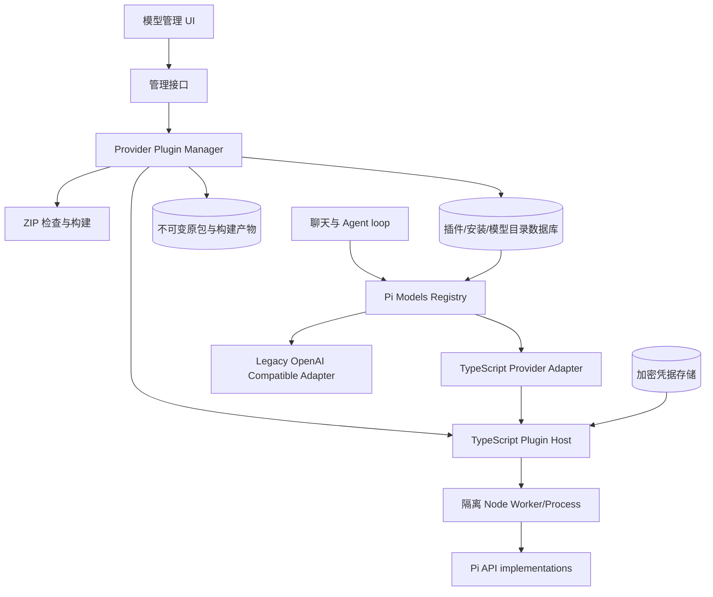
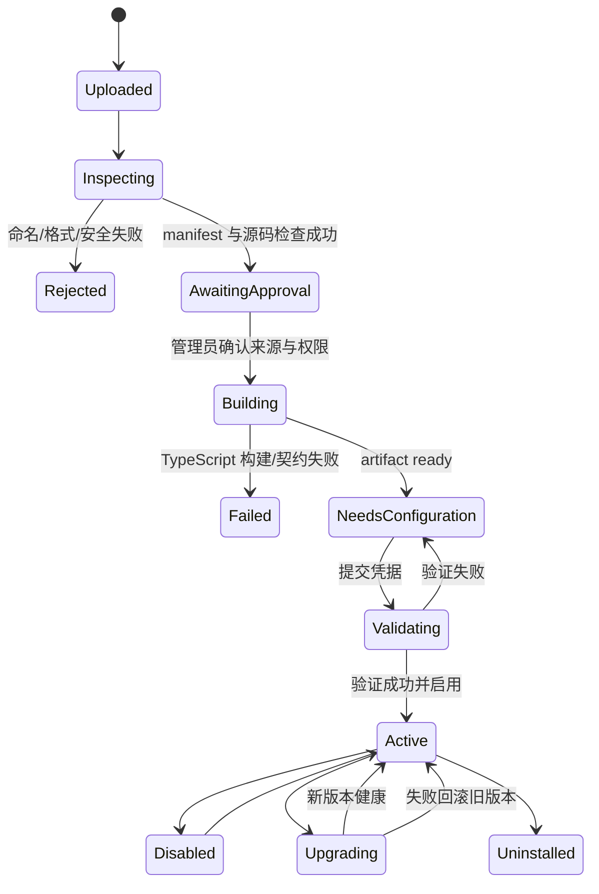

# piwork TypeScript 模型供应商插件机制架构设计

> 状态：架构草案 v2，待评审后实施  
> 基线：piwork 当前工作区；`@earendil-works/pi-ai` / `@earendil-works/pi-agent-core` 0.83.0  
> 强制约束：插件实现语言仅限 TypeScript；安装包名必须符合 `piwork-llm-<provider>.zip`

## 1. 结论

这套机制可以实现，架构收敛为一套 **Pi 原生 TypeScript 模型供应商插件机制**：

1. 聊天、标题生成和 Agent loop 始终只面对 Pi 0.83.0 的 `Models` / `Provider` / `Model` interface。
2. 每个供应商插件都使用 TypeScript 实现，并直接构造 Pi `Provider`。
3. 唯一安装包格式为 `piwork-llm-<provider>.zip`，例如 `piwork-llm-deepseek.zip`。
4. 本地 Dify 模型供应商包只作为配置结构、模型目录和协议实现的迁移参考；不能直接上传、安装或执行。
5. Dify YAML 中可复用的供应商表单、模型元数据、能力、参数和价格信息，在开发插件时转换为 piwork TypeScript package；Dify Python 调用逻辑需要基于 Pi 官方能力用 TypeScript 重写。
6. 上传的 TypeScript 插件不得在 Next.js Web 进程内直接 `import`；插件管理模块负责校验、构建、隔离加载和生命周期管理。

这保留了 Dify 模型包“一个厂商一个可分发包”的优点，同时避免引入 Python、Dify Plugin SDK、Slim daemon 和跨语言事件转换。

## 2. 目标与边界

### 2.1 目标

- 管理员可在“模型管理”中上传 `piwork-llm-*.zip` 并安装。
- 安装后自动呈现供应商信息、图标、动态凭据表单和模型目录。
- 同一插件可配置多个安装实例，例如不同账号、区域或私有网关。
- 用户或厂商可按公开的 TypeScript package contract 开发新供应商。
- 插件通过 Pi `Provider` 接入现有模型调用链，不修改聊天业务代码。
- 支持检查、安装、配置、测试、启停、升级、回滚和卸载。
- 包、安装实例、凭据和模型目录彼此分离，便于复用与审计。

### 2.2 第一阶段范围

- 仅支持模型供应商插件，包名类型固定为 `piwork-llm-*`。
- 仅支持 TypeScript 源码和由规定构建流程生成的 JavaScript 产物。
- 首期启用 LLM：文本、视觉、推理、流式输出和工具调用。
- 模型目录可预留 embedding、rerank、TTS、STT 类型，但在 piwork 有对应消费 interface 前不可启用。
- 保留当前手工 OpenAI Compatible 供应商作为迁移 adapter。

### 2.3 非目标

- 不直接安装 `.difypkg` 或 Dify Python 源码包。
- 不引入 Python、virtualenv、uv、Dify Plugin SDK 或 Dify plugin daemon。
- 不支持混合语言或通过 shell 启动任意解释器。
- 不把工具、数据源、触发器和 Agent Strategy 一并纳入 `piwork-llm-*`。
- 不在首期建设公开 Marketplace 或第三方审核平台。

## 3. 现状与官方能力

### 3.1 piwork 当前模型链路

当前工作区已经形成以下链路：

```text
模型管理数据
  -> loadActiveModelSources()
  -> lib/ai/pi.ts
  -> createProvider()
  -> piModels.setProvider()
  -> streamSimple()/complete()
```

它证明了动态注册方向可行，但当前实现仍有这些限制：

- 所有供应商都被假设为 OpenAI Chat Completions。
- 凭据固定为 `apiKey + baseUrl`。
- context window、max tokens、reasoning 等模型属性被统一写死。
- 模型能力只能表达 `chat` / `multimodal`。
- 测试接口绕开 Pi，直接请求 `/chat/completions`。
- 显示名称同时充当 provider id，无法稳定支持重命名和多个实例。
- API key 以普通字段保存并可在详情接口返回明文。

### 3.2 Pi 0.83.0 的正确 seam

项目安装的 `@earendil-works/pi-ai` 0.83.0 明确定义：

- `Provider` 是具体运行单元，拥有身份、鉴权、模型清单、刷新和流式行为。
- `Models` 是 Provider 集合，负责鉴权解析和调用分发。
- `MutableModels.setProvider()` / `deleteProvider()` 支持动态生命周期。
- `createProvider()` 可组合静态或动态模型清单、鉴权和一个或多个 API stream implementation。
- Pi 官方提供 OpenAI、Anthropic、Google、Mistral 等 API implementations，并支持自定义 `ProviderStreams`。

因此插件外部 interface 应直接返回 Pi `Provider`。聊天代码不应该知道插件 ZIP、manifest、构建产物和加载方式。

Pi Coding Agent 的 `pi.registerProvider()` 属于 Coding Agent 扩展宿主。piwork 当前使用的是 `pi-ai` 与 `pi-agent-core`，所以本方案在 piwork 内实现一个面向 Web 管理场景的插件宿主，但最终仍落到同一个 Pi `Provider` interface。

### 3.3 与 Pi 插件架构的关系

本方案不是另起一套模型协议，而是把 Pi 官方插件架构拆成适合 piwork Web 平台的两层复用：

| Pi 官方架构 | piwork 对应设计 | 关系 |
|---|---|---|
| TypeScript extension 默认 factory | `src/index.ts` 默认导出的 activate factory | 保持同一加载风格 |
| `pi.registerProvider()` | `PiworkLlmExtensionAPI.registerProvider()` | 保持同一注册语义，piwork 只暴露模型插件所需的最小子集 |
| 完整 `pi-ai Provider` | 插件注册的运行时对象 | 直接使用同一 interface，不做二次模型抽象 |
| `unregisterProvider()` / reload | installation 停用、升级、卸载与 registry revision | 语义对应，但生命周期由管理端和数据库驱动 |
| Pi package 的 TypeScript/npm 依赖 | ZIP 中的 `package.json`、lockfile 和 TypeScript 源码 | 结构参考，但分发介质改为受控 ZIP |
| project trust / full system access | 管理员审批、签名、RemotePluginHost | piwork 增加更严格的企业上传隔离 |
| `DefaultResourceLoader` | `Provider Plugin Manager` + `PluginHost` | 不直接复用；前者面向本地 CLI 资源发现，后者面向 Web 上传、多实例和持久化 |

Pi 官方扩展可以注册工具、命令、UI、事件和模型供应商；`piwork-llm-*` 刻意只暴露 `registerProvider()` 等模型相关最小 interface。这是能力收窄，不是改变 Pi Provider contract。

不直接引入 `@earendil-works/pi-coding-agent` 的完整 `ExtensionAPI`，原因是 piwork 当前没有 Coding Agent 的 TUI、session resource loader 和本地信任目录；直接引入会把大量无关 interface 与全系统权限一起暴露给上传包。插件中的 provider implementation 仍可与标准 Pi extension 复用，因为两者最终注册的是同一个 `@earendil-works/pi-ai` `Provider`。

### 3.4 Dify 本地样本如何复用

本地 `llm/` 中三个 Dify 包可作为迁移素材：

| Dify 内容 | piwork TypeScript package 中的对应物 |
|---|---|
| `manifest.yaml` | `piwork.plugin.json` |
| `provider/*.yaml` | TypeScript 导出的 provider definition |
| `models/<type>/*.yaml` | TypeScript/JSON 模型目录 |
| `provider/*.py` | TypeScript `validateCredentials()` |
| `models/<type>/*.py` | Pi 官方 API implementation 或 TypeScript `ProviderStreams` |
| `_assets/*` | `assets/*` |
| `pyproject.toml` / `uv.lock` | `package.json` / `pnpm-lock.yaml` |

需要迁移而不是照抄的行为包括：消息转换、thinking、工具调用、多模态、流式事件、usage、错误映射和凭据验证。

优先复用 Pi 官方 API implementation。例如 DeepSeek 可基于 `openai-completions`；只有供应商协议确实特殊时，插件才实现自定义 TypeScript `ProviderStreams`。

## 4. 总体架构



核心深模块是 `Provider Plugin Manager`：

- interface 只暴露检查、安装、配置、启停、测试、卸载和解析 Pi Provider。
- implementation 隐藏命名规则、ZIP 安全、manifest、TypeScript 构建、模块加载、凭据和 revision。
- 聊天调用方与测试都只跨该 seam。

建议的应用层 interface：

```ts
interface ProviderPluginManager {
  inspect(file: File): Promise<PackageInspection>;
  install(file: File, decision: InstallDecision): Promise<Installation>;
  configure(
    installationId: string,
    values: Record<string, unknown>
  ): Promise<void>;
  activate(installationId: string): Promise<void>;
  deactivate(installationId: string): Promise<void>;
  testModel(ref: ModelRef, signal?: AbortSignal): Promise<ModelTestResult>;
  uninstall(installationId: string): Promise<void>;
  resolvePiProvider(installationId: string): Promise<Provider>;
}
```

## 5. 强制包规范

### 5.1 文件命名

安装包必须满足：

```regex
^piwork-llm-[a-z0-9]+(?:-[a-z0-9]+)*\.zip$
```

有效示例：

```text
piwork-llm-deepseek.zip
piwork-llm-zhipuai.zip
piwork-llm-azure-openai.zip
```

无效示例：

```text
deepseek.zip
piwork-deepseek.zip
piwork-llm-DeepSeek.zip
piwork-llm-deep_seek.zip
piwork-llm-deepseek.tar.gz
```

`<provider>` 是小写 kebab-case 稳定标识。三者必须满足确定的派生关系：ZIP 文件名去掉 `.zip` 后等于 manifest `id`，manifest `provider` 等于 `piwork-llm-` 后面的 `<provider>`：

```text
文件名：piwork-llm-deepseek.zip
manifest id：piwork-llm-deepseek
provider id：deepseek
```

升级不在文件名中加入版本号；版本只由 manifest 管理。`piwork-llm-deepseek-1.2.0.zip` 本身也不符合命名正则，应在读取包内容前拒绝。

### 5.2 ZIP 目录结构

```text
piwork-llm-deepseek.zip
├── piwork.plugin.json
├── package.json
├── pnpm-lock.yaml
├── README.md
├── src/
│   ├── index.ts
│   ├── provider.ts
│   ├── credentials.ts
│   └── models.ts
├── dist/
│   ├── index.js
│   └── index.js.map
└── assets/
    ├── icon.svg
    └── icon-dark.svg
```

约束：

- 源码必须存在于 `src/`，实现语言仅限 TypeScript。
- 入口固定为 `src/index.ts`；构建入口固定为 `dist/index.js`。
- `dist/` 必须由规定构建器产生，安装时会从源码重新构建并比对，不直接信任上传产物。
- runtime dependencies 必须固定版本并出现在 lockfile。
- 禁止 native addon、install script、postinstall、preinstall 和 prepare script。
- 禁止包内嵌二进制、Python、shell、WASM 和其他可执行语言产物；未来如需开放必须升级 package contract。

### 5.3 Manifest

`piwork.plugin.json` 最小示例：

```json
{
  "schemaVersion": 1,
  "id": "piwork-llm-deepseek",
  "provider": "deepseek",
  "name": "DeepSeek",
  "version": "1.0.0",
  "description": {
    "zh-CN": "DeepSeek 模型供应商",
    "en": "DeepSeek model provider"
  },
  "runtime": {
    "language": "typescript",
    "node": ">=22.19.0",
    "source": "src/index.ts",
    "entry": "dist/index.js"
  },
  "capabilities": ["llm"],
  "permissions": {
    "network": ["api.deepseek.com"],
    "filesystem": "none",
    "environment": []
  },
  "assets": {
    "icon": "assets/icon.svg",
    "iconDark": "assets/icon-dark.svg"
  }
}
```

`schemaVersion` 是 package contract 版本，不等同于插件版本。

### 5.4 TypeScript package contract

插件入口采用 Pi extension 的默认 factory 风格，通过受限的 `registerProvider()` 注册完整 Pi Provider：

```ts
import { createProvider } from "@earendil-works/pi-ai";
import type { PiworkLlmExtensionAPI } from "@piwork/model-provider-sdk";

export { definition, validateCredentials } from "./provider";

export default async function activate(pi: PiworkLlmExtensionAPI) {
  pi.registerProvider(
    createProvider({
      id: pi.context.runtimeProviderId,
      name: "DeepSeek",
      auth,
      models,
      api,
    })
  );
}
```

建议 SDK interface：

```ts
interface PiworkLlmExtensionAPI {
  readonly context: ProviderFactoryContext;
  registerProvider(provider: Provider): void;
  onDispose(handler: () => void | Promise<void>): void;
}

interface ProviderFactoryContext {
  installationId: string;
  providerId: string;
  credentials: Readonly<Record<string, unknown>>;
  config: Readonly<Record<string, unknown>>;
  modelsStore: ProviderModelsStore;
  fetch: typeof globalThis.fetch;
  logger: PluginLogger;
}
```

插件不能自行读取数据库、KMS 或进程环境。依赖通过 `pi.context` 注入，以便隔离和测试。宿主在 factory 完成后校验：必须且只能注册一个 provider，其 id 必须等于 `runtimeProviderId`。

`definition` 至少包含：

- 国际化名称、描述和帮助链接；
- 凭据与非秘密配置 schema；
- 模型目录与模型能力；
- 参数规则、价格、弃用信息；
- 声明的网络 host 权限。

## 6. TypeScript Plugin Host

### 6.1 构建与加载

安装流程不直接运行 `tsx`：

1. 解压到隔离 staging 目录。
2. 用平台固定的 TypeScript/esbuild 配置构建 `src/index.ts`。
3. 只允许引用 SDK allowlist、Pi 公开 exports 和审核通过的纯 JavaScript dependencies。
4. 静态扫描 Node built-ins、动态 import、`eval`、`Function`、child process 和原生模块。
5. 生成单文件 ESM bundle、source map、dependency manifest 和构建 hash。
6. 在验证 Worker 中加载，读取 definition 并执行契约测试。
7. 构建成功后把 bundle 作为不可变 artifact 保存。

上传包内的 `dist/` 仅用于作者自检和签名比对；平台运行自己构建的 artifact。

### 6.2 执行隔离

TypeScript 不等于安全。上传代码仍然是任意代码，生产至少提供两种 host adapter：

| Host adapter | 用途 | 说明 |
|---|---|---|
| `WorkerThreadPluginHost` | 开发和受信任内置插件 | 启动快，但与 Web 进程共享 OS 权限，不是安全隔离 |
| `RemotePluginHost` | 生产与用户上传插件 | 独立 Node 容器/进程，通过内部 RPC/SSE 调用，可限制权限和资源 |
| `InMemoryPluginHost` | 测试 | 不加载 ZIP，用确定性 fixture 实现 contract |

这是一个真实 seam：生产 remote adapter 与测试 in-memory adapter 都满足 `PluginHost` interface。

```ts
interface PluginHost {
  inspect(artifact: PluginArtifact): Promise<ProviderDefinition>;
  activate(request: ActivateProviderRequest): Promise<ProviderHandle>;
  validateCredentials(
    request: ValidateCredentialsRequest
  ): Promise<CredentialValidationResult>;
  invoke(request: ModelInvokeRequest): AsyncIterable<ModelInvokeEvent>;
  dispose(installationId: string): Promise<void>;
}
```

Web 进程中的 `HostedPiProviderAdapter` 把 `PluginHost.invoke()` 事件转换为 Pi `AssistantMessageEventStream`。PluginHost 激活 factory 时提供受限的 `PiworkLlmExtensionAPI`，其 `registerProvider()` 语义与 Pi 官方 extension 一致。内置且审核通过的插件也可以选择同进程直接注册 Pi `Provider`，但不能改变外部 interface。

### 6.3 两种供应商实现方式

插件内部优先选择：

1. **Pi 官方 implementation adapter**：调用 `createProvider()` 并使用 Pi 提供的 lazy API implementation。适合 DeepSeek、OpenAI compatible、Anthropic compatible 等。
2. **自定义 TypeScript `ProviderStreams`**：仅用于 Pi 尚未支持的协议，必须完整实现 Pi streaming event contract。

一个 provider 可通过 API map 支持多种 Pi API；不要在聊天层按供应商写条件分支。

### 6.4 Pi registry 生命周期

增加 `ProviderRegistryCoordinator`：

1. 读取带 `revision` 的 active installation snapshot。
2. 通过插件管理模块解析每个 installation 的 Pi `Provider`。
3. 使用稳定 id `installation:<uuid>` 注册。
4. 对旧 revision 中存在、当前已移除的 id 调用 `deleteProvider()`。
5. 原子发布不含凭据的客户端模型目录。

模型公共引用：

```text
installation:<installationUuid>/<upstreamModelId>
```

显示名称和运行时 id 分离，从而支持重命名和同一插件多个安装实例。

## 7. 数据模型

### 7.1 `ProviderPluginPackage`

- `id uuid`
- `packageId`：例如 `piwork-llm-deepseek`
- `providerKey`：例如 `deepseek`
- `version`
- `sha256`，唯一
- `schemaVersion`
- `language`，数据库约束固定为 `typescript`
- `nodeRange`
- `manifest jsonb`、`definition jsonb`
- `sourceStorageKey`、`artifactStorageKey`、`buildHash`
- `sizeBytes`
- `trustLevel`：`builtin | signed | admin-approved | rejected`
- `signatureStatus`、`signatureIssuer`
- `installStatus`：`inspecting | building | staged | ready | failed | quarantined`
- `failureCode`、`failureDetail`
- `createdBy`、`createdAt`

包内容按 hash 不可变。升级创建新记录，不覆盖旧版本。

### 7.2 `ModelProviderInstallation`

- `id uuid`
- `packageId`
- `displayName`、`description`
- `enabled`
- `hostMode`：`worker | remote | legacy`
- `config jsonb`
- `credentialRevision`、`catalogRevision`
- `healthStatus`：`unknown | initializing | healthy | degraded | failed`
- `createdBy`、`createdAt`、`updatedAt`

### 7.3 `ProviderCredential`

- `installationId`
- `schemaVersion`
- `encryptedPayload`
- `keyVersion`
- `maskedSummary jsonb`
- `validatedAt`、`validationStatus`、`validationErrorCode`
- `updatedBy`、`updatedAt`

秘密字段由 plugin definition 标记；响应永不返回明文。当前 `ModelProvider.apiKey` 明文详情接口需要迁移并下线。

### 7.4 `ProviderModelCatalog`

- `installationId`、`modelId`、`modelType`
- `label jsonb`
- `enabled`、`deprecated`、`isDefault`
- `features jsonb`、`properties jsonb`
- `parameterRules jsonb`、`pricing jsonb`
- `piModel jsonb`
- `source`：`predefined | customizable | discovered`
- `catalogRevision`、`updatedAt`

唯一约束为 `(installationId, modelType, modelId)`。企业默认模型使用 installation id + model id，不依赖显示名称。

### 7.5 任务与审计

- `ProviderPluginJob`：inspect、build、install、upgrade、rollback、uninstall 的进度与脱敏错误。
- `ProviderPluginAuditLog`：上传人、审批人、hash、签名、凭据轮换、启停和卸载。
- 详细构建/运行日志进入受限日志系统，数据库只保存摘要。

## 8. 安装、升级与卸载

### 8.1 状态机



### 8.2 上传检查顺序

1. 文件名必须通过 `piwork-llm-*.zip` 正则。
2. 流式接收，限制压缩包大小、解压总大小、文件数、路径深度和压缩比。
3. 计算 SHA-256，重复包直接复用。
4. 拒绝绝对路径、`..`、符号链接、设备文件和 Zip Slip。
5. 解析 manifest，校验 filename、manifest id、provider id 一致。
6. 校验 language 必须为 `typescript`，入口必须为规定路径。
7. 拒绝禁止的文件类型、package scripts、native dependencies 和未锁定依赖。
8. 校验签名、权限与网络 host 声明。
9. 在 staging 中重新构建，并运行静态扫描与 contract tests。
10. 在隔离 host 中加载 definition；代码不得在检查请求线程中执行。
11. 管理员确认后写入不可变存储和数据库，发布 registry revision。

### 8.3 升级与回滚

- 上传文件名保持相同，manifest version 必须高于当前版本。
- 新版本旁路构建，不覆盖当前 artifact。
- 对新凭据 schema 做兼容检查，再执行凭据验证和 smoke test。
- 成功后原子切换 package revision；失败保持旧版本 active。
- 保留至少一个已知可运行版本用于回滚。

### 8.4 卸载

- 先停用并从 Pi registry 删除，阻止新请求。
- 等待或取消在途调用。
- 调用 `PluginHost.dispose()` 释放 Worker/远端 handle。
- 删除 installation、凭据和模型引用。
- source/artifact 被其他实例或回滚版本引用时保留，否则进入延迟清理任务。

## 9. 模型管理 UI

### 9.1 首页

- `安装模型供应商`：文件选择仅接受 `.zip`，并提示命名规则。
- 展示已安装供应商卡片：图标、版本、模型类型、模型数、健康与启用状态。
- `默认模型设置`。
- 后续可增加受控的企业插件目录。

### 9.2 安装向导

1. 上传 `piwork-llm-<provider>.zip`。
2. 立即校验文件名；错误时给出正确示例。
3. 展示 package id、version、hash、签名、Node 范围、网络权限和 dependencies。
4. 管理员确认信任。
5. 后台构建 TypeScript 并显示任务进度。
6. 根据 definition 生成凭据表单，secret 只提交不回显。
7. 调用插件的 `validateCredentials()`。
8. 展示模型目录，允许批量启用并选择默认模型。

### 9.3 详情页

- 概览：package id、version、build hash、host、健康、签名、最后验证时间。
- 凭据：动态 schema、测试连接、轮换凭据。
- 模型：能力、上下文、最大输出、价格、弃用状态和单模型测试。
- 运维：升级、回滚、诊断、停用、卸载。

## 10. 管理接口

```text
POST   /api/management/model-plugins/inspect
POST   /api/management/model-plugins/install
GET    /api/management/model-plugin-jobs/:jobId
GET    /api/management/model-plugins
GET    /api/management/model-plugins/:packageId

PUT    /api/management/model-providers/:id/credentials
POST   /api/management/model-providers/:id/credentials/validate
POST   /api/management/model-providers/:id/activate
POST   /api/management/model-providers/:id/deactivate
POST   /api/management/model-providers/:id/upgrade
POST   /api/management/model-providers/:id/rollback
DELETE /api/management/model-providers/:id

GET    /api/management/model-providers/:id/models
PATCH  /api/management/model-providers/:id/models/:modelId
POST   /api/management/model-providers/:id/models/:modelId/test
```

所有接口继续使用 `requireManagementAdmin()`，并增加上传限流、CSRF、幂等 key 与审计。模型测试必须通过插件管理模块和 Pi Provider path，不能直接拼供应商 URL。

## 11. 安全设计

上传 TypeScript 插件等价于管理员授权执行第三方代码。最低要求：

- 用户上传插件在生产默认使用独立 `RemotePluginHost`。
- runner 使用非 root、只读根文件系统、临时工作目录、独立用户和最小 Linux capabilities。
- 限制 CPU、内存、进程数、文件描述符、磁盘、调用时间和事件输出大小。
- 不挂载宿主源码、数据库文件、Docker socket 或 Web 环境变量。
- 网络只能访问 manifest 声明并经管理员批准的 host；阻止 metadata endpoint 和默认私网地址。
- SDK context 只注入本次 installation 所需凭据、受控 fetch 和脱敏 logger。
- 禁止 `child_process`、`worker_threads`、`vm`、raw filesystem、动态 require/import、`eval` 和 `Function`。
- 禁止 package lifecycle scripts、native addon、二进制和其他语言运行时。
- 使用企业签名或管理员审批；package id 中的厂商名不代表可信。
- 凭据使用 KMS/主密钥 envelope encryption，日志与异常统一脱敏。
- SVG 图标净化或转换后展示。
- 记录 SBOM、lockfile hash、source hash、build hash 和签名。

Worker thread 只提供故障隔离和生命周期便利，不是安全沙箱；用户上传包不能因为“是 TypeScript”就默认在 Web 进程运行。

## 12. 测试策略

### 12.1 package contract tests

- `piwork-llm-deepseek.zip` 等合法命名通过。
- 大写、下划线、缺少前缀、版本混入文件名和非 ZIP 被拒绝。
- filename、manifest id 和 provider id 不一致被拒绝。
- Python、shell、二进制、native addon、package scripts 和未锁定依赖被拒绝。
- 恶意 ZIP、Zip Slip、炸弹、符号链接和超限 manifest 被拒绝。
- 上传源码可重建且 build hash 稳定。

### 12.2 plugin interface tests

每个插件跑同一组 Pi extension 风格 contract：

- definition 可序列化且模型 id 唯一；
- credentials schema 可渲染和校验；
- 默认 factory 只能调用一次 `registerProvider()`，并注册合法 Pi `Provider`；
- provider/model id 与 installation mapping 正确；
- 文本流、reasoning、工具调用、图片输入、usage 和 stop reason；
- abort、超时、限流、鉴权失败和上下文溢出；
- logger 不输出 secret。

### 12.3 Host adapter tests

- `InMemoryPluginHost` 与 `RemotePluginHost` 跑同一组 interface tests。
- 远端断开、重复事件、非法事件、超限输出和取消均转成稳定错误。
- host 重启后可从 artifact 与 revision 恢复。

### 12.4 UI/E2E

- 管理员上传、审批、构建、配置、测试、启用和卸载。
- 非管理员不可访问。
- secret 不出现在浏览器响应、日志、数据库普通字段和测试快照中。
- 安装或升级失败不影响既有模型。

## 13. 实施分期

### Phase 0：SDK 与参考插件

- 创建 `@piwork/model-provider-sdk`，固定 package contract。
- 实现 `piwork-llm-deepseek.zip` 参考插件。
- 参考本地 Dify DeepSeek 包迁移模型目录、凭据 schema 和必要调用行为。
- 验证 Pi 文本流、thinking、工具调用、vision 和 abort。

退出条件：参考插件能通过统一 contract tests，并通过现有 Pi 调用链完成真实或录制请求。

### Phase 1：包管理与构建

- 实现命名检查、ZIP 检查、manifest schema、重新构建、静态扫描和 artifact 存储。
- 新数据表、状态机、任务和审计。
- 实现 `InMemoryPluginHost` 和开发用 `WorkerThreadPluginHost`。

### Phase 2：运行时与 registry

- 实现生产 `RemotePluginHost` 与内部 RPC/SSE 协议。
- 实现 `HostedPiProviderAdapter` 和 `ProviderRegistryCoordinator`。
- 完成凭据加密、验证、模型测试和多实例缓存失效。

### Phase 3：模型管理体验

- 上传向导、构建进度、动态凭据表单、供应商卡片、模型能力和诊断页。
- 把现有 OpenAI Compatible 记录迁移到内置 TypeScript 插件实例。
- 下线旧供应商手工创建路径和明文 API key 返回。

### Phase 4：扩展生态

- 发布插件脚手架、打包命令和 contract test kit。
- 增加智谱、通义等 TypeScript 插件。
- 签名、SBOM、企业插件目录、升级与回滚策略。
- 按产品需要增加 embedding/rerank/TTS/STT 的独立 interface。

## 14. 实施前仍需确认的决策

1. **生产 host**：是否允许新增独立 Node runner 容器。若不允许，首版只能安装平台签名的内置插件，不能安全开放用户上传代码。
2. **依赖策略**：建议首版只允许 `@piwork/model-provider-sdk`、`@earendil-works/pi-ai` 和少量审核过的纯 JS 包。
3. **构建策略**：建议平台从 `src/` 重新构建；不直接运行上传的 `dist/`。
4. **签名策略**：只允许企业签名，还是允许管理员审批未知签名包。
5. **模型类型**：建议首版只启用 LLM，其他类型仅解析和展示。
6. **多租户**：package 可全局去重，installation、credential 和 default model 应按 tenant/企业隔离。

## 15. 风险与缓解

| 风险 | 影响 | 缓解 |
|---|---|---|
| 上传 TypeScript 执行任意代码 | 主机或数据泄露 | remote host、权限 allowlist、签名、网络策略、无 Web 秘密 |
| TypeScript package contract 演进 | 老包不兼容 | schemaVersion、SDK 兼容矩阵、安装时版本门禁 |
| 依赖供应链污染 | 安装阶段执行恶意代码 | 禁止 scripts/native addon；固定 allowlist 和 lockfile；平台构建 |
| 动态加载与 Next.js bundler 冲突 | 部署后无法加载插件 | 插件 artifact 由独立 host 加载，不走 Next.js 静态 bundle |
| 自定义 stream implementation 不完整 | 工具/推理事件丢失 | 优先 Pi 官方 implementation；统一 contract tests；不静默降级 |
| provider 热更新竞态 | 在途请求失败 | revision snapshot、稳定 id、先加载新版本再原子切换 |
| 从 Dify Python 迁移行为遗漏 | 同厂商行为不一致 | 按模型能力建立迁移清单和录制 fixture，对照测试 |

## 16. 验收标准

- 管理员只能上传符合 `piwork-llm-<provider>.zip` 的包。
- 包中插件实现语言为 TypeScript；出现 Python、shell、native binary 或禁止脚本时安装失败。
- 平台从 `src/index.ts` 重建并验证 artifact。
- 启用模型通过 Pi `Provider` 进入模型目录，无需修改聊天业务代码。
- 模型测试和真实聊天经过相同 Pi Provider path。
- 文本流、工具调用、thinking、取消和错误端到端保真。
- 停用或卸载会从 registry 删除 provider，不留下陈旧模型。
- 安装/升级失败不影响现有模型，升级可回滚。
- 用户上传插件不在 Next.js Web 进程权限域内执行。

## 17. 官方参考

### Pi

- [Pi 0.83.0 本地类型：`Provider`、`Models`、`createProvider()`](../node_modules/@earendil-works/pi-ai/dist/models.d.ts)
- [Pi 官方 Custom Providers](https://pi.dev/docs/latest/custom-provider)
- [Pi 官方 Extensions](https://pi.dev/docs/latest/extensions)
- [Pi 官方 Custom Models](https://pi.dev/docs/latest/models)
- [Pi 官方源码：models 设计](https://github.com/earendil-works/pi/blob/main/packages/agent/docs/models.md)

### Dify 迁移参考

- [Dify 官方模型插件仓库](https://github.com/langgenius/dify-official-plugins)
- [Dify Plugin SDK](https://github.com/langgenius/dify-plugin-sdks)
- 本地 `llm/` 下 DeepSeek、智谱和通义包，仅用于结构与行为迁移，不作为可安装运行时。

## 18. 与官方能力保持一致的关键点

- 插件直接产出 Pi 0.83.0 `Provider`，由 `Models.setProvider/deleteProvider` 管理生命周期。
- 优先复用 Pi 官方 API implementations，不自行复制已支持的模型协议。
- 自定义协议实现 Pi `ProviderStreams` 和完整 streaming event contract。
- 模型目录读取保持同步 snapshot；安装、构建和刷新是显式异步动作。
- 鉴权归属 provider installation，调用方不直接拼接鉴权请求。
- Dify 资料只用于迁移配置与行为，运行时完全是 TypeScript/Node。
