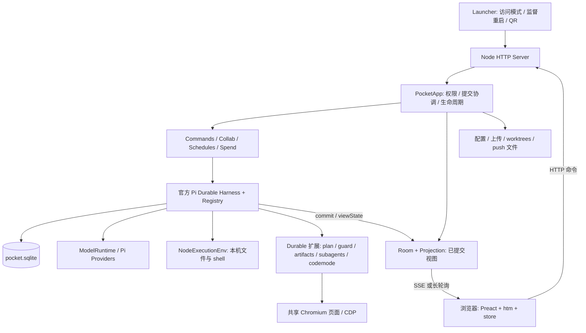

# Pi Pocket 技术架构分析与 Piwork 借鉴建议

> 版本说明：本文 Pocket 外部仓库版本和 Piwork 对照版本是调研时的历史快照，不代表 Piwork 当前依赖。当前版本与兼容性验证见 [升级记录](pi-upgrades.md)。

> 核对日期：2026-10-09。对象：本机 `~/Works/yepeng/code/pi-pocket` 工作树，版本 **0.11.0**，HEAD `d01f763b02f06ff6144d4366eb966a76dbb35577`；其 `package-lock.json` 有未提交修改，本报告不将工作树等同于纯净发布包。Piwork 对照基线：HEAD `73144356fe419cf849495d690910b334da773dad` 与当前代码。
>
> **性质：源码调研与建议，不是实施记录。** 本次未启动服务、未执行两项目测试、未调用真实模型，也未修改 Pi Pocket。依赖版本、实现路径与测试设计来自静态核查；不构成安全审计、生产恢复或容量验收。Piwork 现状以 [当前架构](architecture.md)、[开发约定](development.md) 和代码为准。

## 1. 核心结论

Pi Pocket 不是缩小版的企业 SaaS，而是一个 **local-first、单机单 Writer、可信协作者共用的 Durable Agent 工作台**。它把官方 Pi Durable 的会话、任务和提交视图直接作为应用核心，围绕它提供移动端、协作、文件审阅、浏览器与后台任务。

Piwork 则是 **企业控制面 + 平台 Runtime 协议 + 多种 Pi 后端 + 受管执行面**。其正式身份、组织权限、归档和沙箱治理，比 Pi Pocket 的可信本机模型有更多约束。

最值得借鉴的是：

1. **持久事实、临时连接状态、客户端展示投影分离**，尤其是快照初始化和增量更新。
2. **实时数据有界化**：流合并、工具结果截断、展开再取详情、仅订阅可见任务。
3. **协作产品体验**：人类旁聊不自动进模型、共享笔记、轮流控制、多任务预览。
4. **提交身份与幂等语义明确**，并把恢复顺序和费用归属顺序写成契约。
5. **用真实官方运行时 + 脚本模型 + 独立目录测试应用行为**，而不只测试假事件。

不建议为借鉴这些能力，把 Piwork 改成 Preact、去掉 Next.js/PostgreSQL，或把所有聊天直接装进一个 `pocket.sqlite`。

## 2. 技术栈清单

Pi Pocket 的版本列取自其 `package.json`；带 `^` 的版本是声明范围，不代表精确安装版本。核心 Durable/coding-agent 安装包已核对为 1.0.2。

| 层 | Pi Pocket | 用法及判断 |
| --- | --- | --- |
| 运行环境 | Node.js `>=22.19`、ESM、TypeScript `^5.9.3` | Node 类型剥离直接运行 `.ts`；只允许可擦除语法，使用 `.ts` 导入，无服务端编译步骤 |
| HTTP 服务 | `node:http` | 自建路径路由、JSON API、静态资源、SSE、长轮询；没有 Next.js/Express 框架 |
| Agent 运行 | `@earendil-works/pi-durable` **1.0.2** | `Harness` 管理 generation/tool/task/checkpoint/inbox，不自行实现 agent loop |
| 模型与 Pi 配置 | `pi-ai`、`pi-coding-agent` **1.0.2** | `ModelRuntime`、`SettingsManager`、Pi provider 登录、Skill 和 prompt templates；不是以 `AgentSession` 作为核心 loop |
| 状态基础 | `@earendil-works/chord` **1.0.2** | Durable 文档和提交后的复制状态；浏览器收到的是应用 JSON 投影，并非直接运行 Chord 同步协议 |
| 脚本工具 | `@earendil-works/pi-codemode` **1.0.2** | 自定义 Durable codemode 扩展，脚本内工具逐次校验和执行 hooks |
| Runtime 存储 | 官方 Node SQLite adapter | `pocket.sqlite` 保存会话、entries、tasks 与应用文档；WAL + 默认 `synchronous=NORMAL` |
| 配置/文件 | JSON 文件 + 本地文件系统 | `config.json`、`push.json`、uploads、worktrees、drop-in extensions；不是所有数据都在 SQLite |
| Web UI | Preact `^11.0.0` + htm `^3.1.1` | 原生 ES modules、模板字符串、手写 store、CSS variables；不需要 JSX/Vite 构建 |
| 富文本 | marked `^18.0.14`、DOMPurify `^3.4.16` | Markdown 解析与净化；自有代码着色、diff、HTML/SVG 预览 |
| 实时通信 | SSE + JSON 长轮询 | HTTP 提交命令，事件流推状态；并非 WebSocket 聊天架构 |
| 移动入口 | Web App Manifest + Service Worker | 安装到主屏幕、Web Push、通知操作、系统分享；不等于离线运行 Agent |
| 内置浏览器 | Chromium + 自建 CDP pipe 客户端 | 单 Chromium、每会话页面/独立浏览上下文，Agent 与用户共看同一页面；无需 Playwright/Puppeteer 运行依赖 |
| 其他 | undici `8.10.2`、qrcode `^1.5.4`、jiti `2.7.0` | HTTP 配置、入口二维码等；不可仅由依赖存在推断具体加载方式 |
| 质量工具 | `node:test`、tsc、ESLint、Prettier | 官方 faux provider 驱动实际应用；部分场景使用真实 Chromium |

**“无构建”并不等于无依赖或 CDN 应用。** `http/assets.ts` 从本地 `node_modules` 显式提供 Preact、hooks、htm、marked、DOMPurify 的 vendor 模块；浏览器用 import map 解析。其优势是本机轻部署、即时改动；代价是模块加载顺序、手写状态和热更新契约需要人工维护。

## 3. 架构分层与进程拓扑

图中 `NodeExecutionEnv` 是**本机执行**，不是企业沙箱；SQLite 提交原子性也不覆盖 shell、HTTP 或浏览器的外部副作用。

### 3.1 Launcher：把访问和重启从 Agent 生命周期拆开

`bin/pi-pocket.js → src/launcher/main.ts → src/server/main.ts`。

- Launcher 提供 `local`、`lan`、Cloudflare quick tunnel、Tailscale 访问方式。
- Server 是子进程；Launcher 可在退出码 75 或崩溃后重启它，隧道可独立继续存在。
- Server 取得数据目录锁后，打开一个 `PocketApp` 并创建 HTTP handler。
- 隧道是访问通道，不是执行隔离、可靠任务调度或生产高可用。

### 3.2 PocketApp：组合根和提交协调器

`src/server/app.ts` 创建一个 Harness、一个 ModelRuntime 和所有业务部件；所有会话及子 Agent 共用这一 SQLite 存储。

业务拆分为 `commands`、`collab`、`workspace`、`transcripts`、`attribution`、`schedules`、`goals`、`spend`、`alerts`、`providers` 等。HTTP 层负责解析、入口校验和响应；业务方法再次执行 steering/driver 等权限检查，因此内部任务调用也不会只依赖路由鉴权。

但这些部件共享 `PocketApp` 引用，核心文件仍较大。这是适合单机的组合方式，不应据此合并 Piwork 的 protocol/backends/run/db 边界。

### 3.3 Harness 与扩展：复用官方 Durable，不是套一层 CLI RPC

`app.ts` 安装官方 `CodingTools`，再安装 `defineExtension` 定义的工具、prompt sections、hooks 与 tasks，最后 `Harness.open(storage, options, context)`。

Pi coding-agent 在此主要提供模型运行时和配置能力；Pi Pocket 自己的扩展是 **Durable Extension**，并不是 Pi coding-agent 的 ExtensionAPI 插件。README 明确不支持直接加载 Pi 原生 extensions；支持 Skill/prompt template 不等于支持任意 Pi Package/MCP。

这对 Piwork 很重要：不能把 Pocket 的 `registry.install()` 直接套到现有 `createAgentSession()` 扩展装配路径，两种接口需要分别核对。

## 4. 请求、提交与实时同步

### 4.1 一条消息如何流转

1. 浏览器 `POST /api/c/:id/submit`，携带客户端 request ID。
2. `http/api.ts` 验证身份，非 GET 检查 `X-Pocket`；会话路由先 `requireSee`。
3. `Commands.submit()` 检查控制权、模型、费用，展开 Skill/template 与附件，构造 `u:<userId>:<clientKey>`。
4. 官方 `conversation.submit()` 持久接纳输入，按 `steer` 或 `followUp` 处理繁忙会话。
5. Harness 执行模型/工具任务，把 entries、文档及任务阶段提交到 SQLite。
6. `PocketApp.#committed` 更新费用与内存索引，`Room` 从 `viewState()` 读取提交后的状态。
7. `projection.ts` 转成展示 JSON，经 SSE/长轮询送至 `web/store.js`，Preact 渲染。

**requestId 的幂等只保证不重复接纳同一提交。** 它不让任意 shell、上传或外部 API 自动获得“恰好一次”效果。

### 4.2 已提交视图与轻量投影

Room 不把底层完整 transcript 原样广播：

- 首次连接发 `hello → sessions → full view`，以及旁聊/笔记等初始数据。
- 后续用每连接 `sentEntries`、顺序标记及 `sentFields` 发新 entries 和变化字段。
- 缓存不可变 entry 的投影；流式状态来自 `pi.live`。
- `projection.ts` 普通工具结果约截至 8,000 字符、实时输出保留尾部约 4,000 字符、工具字符串参数约 1,500 字符；展开详情再读取完整 entry。
- 房间更新合并窗口 90ms、会话目录 400ms、peek 1s。它们是源码中的节流参数，不是容量或延迟 SLA。
- 无主视图连接和 peek 观察者后，Room 等 30s 再释放 view/timers，降低快速刷新重建成本。

这里的“提交后展示”主要指 Durable 派生视图。presence、typing、待审批队列和浏览器页面等仍有纯内存状态；不能声称所有 UI 状态均已持久化。

### 4.3 SSE 与长轮询的关系

`http/events.ts` 为每个连接建立相同的 `Client` 抽象。

- SSE：15s ping，`x-accel-buffering: no`，浏览器 EventSource 重连。
- 长轮询：通常最多等待 25s，60s 未使用回收；响应有 `seq`，客户端用 `ack` 确认，响应丢失可重复发送未确认事件。
- 服务端重启或 poller 消失：重新 attach 并发送当前完整视图，不依赖旧连接内存。
- 浏览器在流初始化停滞时可切到 poll，并暂存这一站点的传输偏好。

**不要混淆三种恢复：** 浏览器重连重建当前视图、传输 ack 重发、Harness 恢复任务是不同机制。Pocket 的 SSE 也不是 Piwork PostgreSQL RuntimeEvent cursor 的同义替代。

风险：当前 SSE 写入未体现完整慢消费者背压处理，poller 未确认队列没有在该模块中看到显式长度上限。应借鉴协议设计而非直接复制为企业规模事件总线。

## 5. 持久化、恢复和扩展边界

### 5.1 存储分工

| 类别 | Pi Pocket 归属 | 恢复含义 |
| --- | --- | --- |
| transcript / inbox / tasks / live / usage | Pi Durable SQLite | 官方状态和任务阶段可重新打开 |
| sessions / authors / artifacts / side chat / notes / schedules / spend 等 | `docs.ts` 的 `defineDoc` / `defineDocFamily` | 可与 entries/tasks 在同一提交中变更 |
| 人员、token 哈希、设置、push subscription | 本地 JSON | 不在 Durable 同一事务内 |
| 上传、git worktree | 本地文件系统 | 不随 Durable commit 自动原子化或回滚 |
| 在线、输入中、待审批、浏览器页面、进行中的登录 | 内存 | 重启后重建或丢失，需专门语义 |

文档显式声明 `scope`、`history`、`fork`。例如 fork 继承旁聊/笔记/制品，但不继承后台子 Agent、计划任务、轮流控制和 goal。**fork 是状态复制政策，不只是复制文字。** 文档 kind、version、scope 和 fork 是存储契约，不能随意重命名。

### 5.2 恢复顺序值得借鉴，锁接管策略不能照搬

Pocket 启动顺序：取得锁 → 准备模型/registry → 打开 storage/Harness → 恢复会话、归属与索引 → 修复遗漏作者 → 加载费用 → 订阅提交/审批/浏览器 → 最后 `harness.resume()`。

这个顺序避免恢复任务先运行、监听和费用归属还未准备好。提交协调器也显式先处理 UsageDoc，再处理会改变当前 requester 的 submission；内部写入延后执行，不在同步提交 listener 中重入 Harness。

但 `lock.ts` 按 PID/进程探测移除死亡进程遗留锁，这只是本机假设。Piwork 已采用 `O_EXCL` owner marker 和 user/chat/run/inputHash/version 绑定，**不自动按 PID/TTL 偷锁**，应保持更严格规则；宿主死了不等于沙箱中的旧命令已停止。

官方 Node SQLite 默认是 WAL + NORMAL，保证与主机掉电恢复不能混为一谈。Piwork `storage.ts` 已显式改 FULL，但仍需持久卷、备份、单 Writer 和副作用对账，不能据此宣称主机容灾已完成。

### 5.3 工具重放、审批与热加载

- 官方 Durable 默认工具 `replay=unsafe`；中断执行不自动再跑，safe 需要重复执行无害或可证明幂等。
- Pocket 的 artifact/schedule 有稳定任务/调用标识去重；codemode 和 subagent 工具明确 unsafe。
- Guard 用 `beforeTool`，判定 allow/block/ask；已回答结果写 `api.memo`。尚未回答的待审批请求仅内存，重启可能重新询问。
- Plan mode 同时提供 prompt 和工具 hook 拦截；其中 shell/工具分类不是企业级隔离证明。
- codemode 为嵌套调用重新做参数校验、执行 before/after hooks，并隔离调用 memo 命名。这个“每个嵌套操作仍受检查”原则值得复用。
- `reload.ts` 明确内建顺序、保留工具名/drop-in 默认关闭；成功后替换 registry 中同名扩展，运行中的调用继续旧代码，下一阶段用新代码。
- `PocketHost` 是窄接口，有利于减少业务耦合；但扩展仍是可信宿主代码，不能把窄 TypeScript 接口当权限沙箱。

Piwork 的恢复必须继续早于 `submit/wait/resume` 做未知结果检查，并在每次 execute 复核授权。**不得用一次已 memo 的审批代替恢复后的当前授权。** 热替换也不适合直接成为生产插件发版方式，应使用版本固定、审核、回滚和运行配置绑定。

## 6. 产品能力及其技术含义

| 能力 | 具体实现 | 可以借鉴什么 / 不能推导什么 |
| --- | --- | --- |
| 多人协作 | `collab.ts`、ChatDoc/NotesDoc/TurnsDoc，Room presence/typing | 人类旁聊不进模型；笔记 rev 防覆盖；driver 控制；不是分布式 CRDT 编辑器 |
| Peek 多任务观察 | `web/peeks.js`、Room.peek、`MAX_PEEKS=12` | IntersectionObserver/页面可见性控制订阅，摘要仅最近 8 行；不是 12 并发任务容量结论 |
| 费用限制 | UsageDoc + SpendDoc、requester attribution | 父会话聚合子 Agent 费用，超限后 abort；没有请求前费用预留，不能保证零超支 |
| 子 Agent | `extensions/subagents.ts` 的 anchor/reporter tasks | 后台所有权、父停止不必取消后台、报告 requestId 去重；需明确定义取消和计费语义 |
| 定时/目标循环 | schedule Durable task、goal 的 generation hook | 计划和 task 同提交；goal 有次数上限；不适合直接替换企业调度和额度治理 |
| Fork/worktree | 官方 fork + git worktree | 从某 entry 分叉和独立工作区；git worktree 不是安全沙箱 |
| 文件与变更审阅 | workspace/files/changes + diff UI | 文件按需读、词级 diff、已审阅标记；本机路径权限不能照搬到企业 API |
| 浏览器共看 | Chromium CDP pipe、页面 screencast/input | 统一 Agent/人工操作页面；本机 localhost/file/JS evaluate 能力应视为高权限 |
| PWA/Push/Share | manifest、sw、push/alerts | 完成/审批通知、系统分享入草稿、移动入口；SW 不缓存应用供离线用，分享仍需人工确认发送 |
| 活动内容预览 | DOMPurify、CSP、opaque-origin iframe | 区分静态 Markdown 和可运行 HTML；opaque origin 不等于无网络/无弹窗，应重新设计企业预览策略 |
| 移动导航 | `back.js`、`gestures.js` | Back 优先关闭 sheet/抽屉/覆盖层，防误触与可见性；不要把手写 history 控制直接混入 Next Router |

### 安全模型必须先说清

Pocket 的 owner/guest/viewer 角色面向“可信的人共用我的机器”。拥有 steering 权限的人能让 Pi 用宿主身份执行命令，可能触达整个主机、凭据和应用代码。单会话邀请限制的是应用里可见范围，不是 OS 文件/网络边界。Guard 默认关闭；开启后也不是 RBAC、进程隔离或不可绕过的执行安全保证。

Piwork 不应引入这一信任模型：保留正式 enabled 身份、成员/角色模型授权、受保护 LibraryItem、模型凭据控制面隔离与 SandboxHandle。浏览器/PWA/协作是新能力，也必须逐入口鉴权、逐执行复核，而非继承“已加入房间就能执行一切”。

## 7. 与 Piwork 当前实现的对照

| 维度 | Pi Pocket | Piwork 当前实现 | 建议 |
| --- | --- | --- | --- |
| Web 技术 | Preact/htm、原生模块 | Next.js 16.2.10、React 19.2.7、Tailwind、Radix、SWR、AI SDK 7.0.15 | 保留现有栈，迁移交互原则而非 UI 框架 |
| 运行边界 | HTTP → PocketApp → Harness | route → RunManager → RuntimeBackend → Pi AgentSession；实验 Durable 走 Harness | 保留平台协议，Durable 能力在 backend 内适配 |
| 事实存储 | 单 SQLite 覆盖全部会话/应用文档 | PG 控制面/消息/事件；每运行私有 SQLite 保存 Durable 执行状态 | 保持分工，禁止因“统一数据库”重写官方 Storage |
| 实时 | committed view + Room 投影 | RuntimeEvent → stream-mapping；持久关键事件重放、部分流增量仅内存 | 借鉴有界 snapshot/projection，但不能声称 Piwork 所有 delta 已持久化 |
| 协作 | presence/typing + 旁聊/notes/pins/turns | 分享、协作者、fork、SSE hub/presence/typing/消息与 run 通知已存在 | 已借鉴部分不能再列成新功能；优先增加协作语义 |
| 繁忙输入 | Durable inbox 的 steer/followUp | RuntimeCommand 已有 steer/followUp/clearQueue | UI/权限/持久去重仍需单独验收；不是另建 loop 的理由 |
| Durable 恢复 | 单机重启后 resume | owned SQLite、未知结果阻断已实现；组合后端 fresh-run，生产/自动恢复拒绝 | 只借鉴恢复准备顺序，不能直接开启生产 resume |
| 调度/额度 | Durable task、按美元的个人/会话限额 | PG 计划领取与运行记录、角色共享已记录 Token 额度 | 增强归属/展示，保留既有口径；美元估算不替换 totalTokens |
| 执行隔离 | NodeExecutionEnv + worktree | Docker/OpenSandbox seam、RPC/实验 tools；凭据代理与私有交付 | Piwork 的安全边界应更严格，不降级为宿主 CodingTools |
| 插件 | 可信 Durable drop-in 热加载 | 受管 Pi Package/MCP/模型插件；不同后端支持存在限制 | 提升能力目录/版本可观察性，不能自动扩张到 Durable/RPC |

已存在借鉴的直接证据：`lib/collab/chat-event-hub.ts` 的注释明确引用 Pocket Room，typing TTL 同为 6s；Piwork 采用“通知不含正文，客户端重拉 PG 消息或 attach run”，而不是复制 Pocket 的完整视图广播。多副本外部总线仍未实现。

## 8. 优先级建议与落地边界

以下为新增建议，不是本次实现。优先级按收益和风险排序，不表示需要同时推进。

| 优先级 | 工作项 | Piwork 推荐落点 | 最低验收条件 |
| --- | --- | --- | --- |
| **P1** | 工具卡片轻量投影、展开取详情、按 toolCallId 去重 | protocol/backends/run、stream-mapping、聊天组件 | 大输出有上限；详情读鉴权；截断不破坏最终归档；SDK/RPC/Durable 展示一致；敏感载荷不进摘要 |
| **P1** | 可见任务摘要/peek 工作台 | run 查询/投影 + hooks/components | 只订阅可见且有权限的 run；隐藏/离开退订；迟到连接不覆盖新状态；不泄露其他成员内容 |
| **P1** | 移动 Back、弹层层级和通知跳转契约 | 现有 Next Router、Dialog/Sheet、聊天 hooks | 390px/窄屏 Back 先关覆盖层；深链接、切换聊天、草稿不丢；不增加第二个 history 路由系统 |
| **P1** | 恢复/投影/身份顺序的契约测试 | tests/unit/runtime、tests/support | 官方 fauxProvider + 真实 backend；延迟落库、晚加入、切换连接、权限撤销、重启断点；不以假事件替代全部运行验证 |
| **P2** | SSE 异常的轮询补偿 | 平台 HTTP/订阅层，不改变 RuntimeBackend 选择 | 先排查 nginx buffering；游标和 ACK 有界；401/403 不降级绕过；终态/取消/迟到响应一致；只回退传输，不回退后端 |
| **P2** | 人类旁聊、共享笔记、pins/reactions | lib/collab、lib/db、聊天 UI | PG 存业务真相；旁聊不自动进入模型；笔记 revision/CAS；成员移除立即停止新操作；删除/fork 策略明确 |
| **P2** | 轮流控制和繁忙输入 UX | collab + RunManager command 接口 | 控制权在服务端持久条件更新；消息幂等绑定 user/chat/key/hash；steer/follow-up 的身份、模型、额度复核；不改变 per-chat 单活跃 run |
| **P2** | PWA、任务完成通知、系统分享入草稿 | manifest/SW、通知业务层与 DB 查询 | HTTPS/用户同意；退出/撤权解绑订阅；通知默认不带正文/命令；点击重新鉴权；分享只填草稿、不自动执行 |
| **P3** | 企业审批/plan 模式 | 平台工具授权 + 持久 intent/审批记录 | 请求参数/配置 hash 绑定；审批人职责分离；到期/撤权复核；全部嵌套调用受管；未知副作用不重放；不要仅关键词判 shell 安全 |
| **P3** | 子 Agent、持久 inbox、任务图 | Worker/RunDescriptor + backend + RuntimeEvent 投影 | 先完成 Worker/账本/预算/沙箱所有权；父子取消与独立授权、计费、交付归属明确；不在前端直接解析 Durable task graph |
| **P3** | 可共看的浏览器与主动 HTML 预览 | 独立受管执行/预览面 | 禁止宿主 file/内网随意访问；单租户 profile、egress、资源额度、下载私有归档；iframe 不带同源权限，网络/表单/弹窗受控 |

### 推荐先做的三个增量

**第一批：工具结果有界展示 + 真实投影测试。** 最小改变现有产品和安全面，先降低长输出对网络和渲染的负担。不能只靠 CSS 折叠，因为完整 payload 仍会传输。

**第二批：多任务摘要 + 移动导航。** 复用现有 AgentRun/RuntimeEvent 和授权，先做只读预览；这不要求先上线子 Agent 或 Durable 自动恢复。

**第三批：旁聊与共享笔记。** 现有协作已让多人共享对话，下一步应让“人类讨论”和“发给 Agent 执行”明确分开，避免无意增加上下文、费用及执行风险。

生产恢复仍沿 [沙箱执行面方案](sandbox-execution-surface-design.md) 与 [Durable 采用门禁](pi-durable-evaluation.md) 推进；不可用这些 UI 改进作为绕过 P2/P3/D1 的理由。

## 9. 不建议照搬的做法

1. **全站改 Preact/无构建**：现有管理、国际化、编辑器与 React 生态的迁移成本高，没有证据说明它们是瓶颈。
2. **PG 换单一全局 SQLite**：控制面和 Runtime 状态职责不同；Pocket 的单 Writer 不对应企业横向扩展。
3. **PID 失效立即接管并 resume**：外部沙箱和未知副作用仍可能存在，违反 Piwork 的 fail-closed 恢复策略。
4. **运行宿主 CodingTools、随意切 cwd/worktree**：worktree 只隔开 Git 文件，不隔开权限和网络。
5. **允许用户 drop-in 热加载宿主代码**：名称保留、窄 host interface、Worker 都不能单独证明强隔离。
6. **把 Lancet Guard/plan 分类器当安全策略**：默认开关、模型判断与人工批准不能替代授权、限额和执行隔离。
7. **默认允许 HTML scripts/forms/popups 或宿主 Chromium 自动化**：移动便利不应以企业内网和凭据暴露为代价。
8. **复制 Pocket 美元花费到现有 Token 统计**：其 cost 是估算聚合，不是结算账单；Piwork 继续保留官方 totalTokens 与缺口标记。

## 10. 证据索引与官方依据

### Pi Pocket 源码（均相对于 `~/Works/yepeng/code/pi-pocket`）

| 路径 | 核查内容 |
| --- | --- |
| `package.json`、安装包 `package.json`、`README.md`、`docs/architecture.md`、`docs/map.md` | 版本、运行约束、产品能力、模块/进程定位 |
| `src/server/app.ts` | CodingTools/registry、Harness.open、恢复顺序、两遍提交协调、MAX_PEEKS |
| `src/server/commands.ts`、`requests.ts` | 权限、submit/steer/followUp、作者和 requestId、fork |
| `src/server/room.ts`、`projection.ts`、`http/events.ts` | viewState、字段去重、节流、截断、连接与轮询协议 |
| `src/server/docs.ts`、`lock.ts`、`spend.ts` | 文档 scope/fork、PID 锁策略、费用归属及超限 abort |
| `src/server/host.ts`、`reload.ts`、`extensions/{guard,plan,codemode,subagents}.ts` | 审批 memo、热更新、嵌套 hooks、后台 task 所有权 |
| `src/server/http/{assets,artifacts}.ts`、`browser/` | 本地 vendor/CSP、活动预览权限、CDP 浏览器 |
| `web/{store,peeks,back,sw}.js`、`manifest.webmanifest` | SSE/poll、可见性、移动返回、通知和系统分享 |
| `test/helpers.ts`、`test/{app,approvals,schedules,spend,projection}.test.ts` | 独立目录、官方 faux provider、重开/幂等/投影场景；本次未运行 |

### Piwork 直接对照

- `package.json`；`lib/ai/agent-session.ts`（AgentSession/资源装配）。
- `lib/runtime/protocol/{commands,events,run-descriptor}.ts`；`lib/runtime/run/run-manager.ts`（关键事件先落库，部分 delta 仅内存）。
- `lib/runtime/backends/durable/{storage,recovery,sandbox-backend}.ts`（版本绑定、owned SQLite、FULL、未知结果阻断、生产拒绝）。
- `lib/collab/chat-event-hub.ts`；`lib/db/chat-share-queries.ts`；[协作文档](chat-collaboration.md)。
- [当前架构](architecture.md)、[开发约定](development.md)、[Durable + Sandbox](durable-sandbox-composition.md)、[Runtime 实施记录](runtime-foundation-implementation.md)。

### 官方 Pi 资料

核心行为以 **Pocket 实际安装 1.0.2 / Piwork 1.0.3** 的官方包为准，不以第三方 README 的宣传替代 API 语义：

- Pocket `node_modules/@earendil-works/pi-durable/README.md`，完整核查 Concepts、Persist and Resume、Watching a Conversation、Tools、Hooks、Forks、Subagents、Storage 等章节。
- 两项目安装版 `pi-durable/dist/harness/types.d.ts` 与 Pocket `dist/harness/harness.d.ts`：Harness、viewState、replay、hooks/运行契约；Pocket `dist/storage/sqlite/node.js`：WAL/NORMAL 默认值。
- 官方源码入口：[Pi Durable](https://github.com/earendil-works/pi/tree/main/packages/durable)、[官方 SDK](https://pi.dev/docs/latest/sdk)、[官方 Extensions](https://pi.dev/docs/latest/extensions)。在线 latest/main 只作后续查阅入口，本次未将它们当作安装版核验结果。
- 调研时 Piwork 固定 1.0.3；其 Durable ExecutionEnv/FileSystem/Shell 与 1.0.2 有 breaking changes。Pocket 集成代码不能原样复制，尤其不能把平台 SandboxHandle 当作官方 NodeExecutionEnv 接口。

**最终判断：学习 Pocket 如何把 Durable 做成“可协作、可观察、适合手机”的工作台；保留 Piwork 对身份、协议、权限、控制面数据和受管执行的企业边界。**
