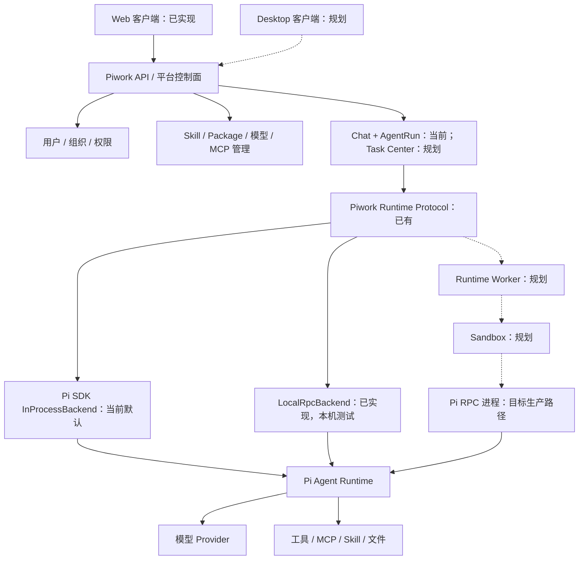

# Piwork 平台与 Agent Runtime 演进架构

> 状态：**目标架构与迁移路线**，不是当前系统拓扑。2026-10-02 按当前代码核对；Pi 主包 `@earendil-works/pi-ai`、`pi-agent-core`、`pi-coding-agent` 均为 1.0.0。
>
> 本文吸收“Web 企业工作台 → 独立 Runtime → 未来 Desktop 本地 Runtime”的产品方向。当前事实和请求时序见 [项目架构](architecture.md)、[聊天业务链路与 RPC](rpc-business-flow.md)；Package、Sandbox 和 Worker 的详细设计见 [Pi Package 与 Runtime 架构](pi-plugin-support-research.md)。

## 1. 核心边界

Piwork 是企业工作平台。平台拥有用户、权限、运行记录、资源授权、审计、持久化和产品界面；Pi 负责 Agent 会话、模型交互、工具调用与扩展执行。浏览器和未来可能的桌面客户端通过平台契约接入，不直接消费 Pi SDK/RPC 的内部事件。



这里的 `RuntimeBackend` 是**平台内部的执行契约**，RPC 是其中一种 Pi 适配方式。平台协议目前仍有 Pi `Model`、`Message` 和 `AgentTool` 类型，尚不是完全独立于 Pi 的跨进程 DTO。应先把它作为稳定的模块边界，再在 Worker 序列化边界逐步收敛，不需要现在重组仓库或预先支持其他 Agent。

## 2. 原架构描述与当前代码的映射

| 概念 | 当前落点 | 状态与说明 |
| --- | --- | --- |
| Web Client / API | `app/(chat)`、`app/(management)`、`components/` | 已实现 Next.js Web；聊天经 HTTP UI message stream 返回 |
| 用户、组织、RBAC | `app/(auth)`、`lib/management`、`lib/db` | 已有身份和管理权限；更细的 Package/工具运行授权仍需完善 |
| Task Center | `Chat`、`AgentRun`、`RuntimeLease`、`RuntimeEvent` | 当前以 chatId 组织运行；尚无独立 Task Service、任务队列或通用 Task API |
| Workspace | `lib/ai/agent-tools.ts` 的聊天工作区 | 当前按 chat 隔离目录；不是经 Sandbox 强制的任务级文件边界 |
| Runtime Protocol | `lib/runtime/protocol` | 已有 `RuntimeSpec`、命令、事件、Backend/Session 接口 |
| Agent Runtime / Worker | `lib/runtime/run`、`lib/runtime/backends` | `RunManager` 在 Next.js 进程内；独立 Worker 尚未落地 |
| Pi SDK / RPC | `in-process/backend.ts`、`local-rpc/backend.ts` | SDK 是聊天默认；本机 RPC adapter 已实现并通过契约测试，但尚未接入生产组装 |
| Skill Store | `lib/ai/skills.ts`、`managed-skills.ts`、`lib/pi-packages` | 已有 Skill 管理、启用和聊天调用；企业审批、不可变制品与 Sandbox 内加载是后续工作 |
| MCP / 文件交付 | `lib/mcp`、`lib/ai/agent-tools.ts` | 当前链路可用；RPC 模式的平台工具闭包和 `deliver_file` 仍需跨进程桥接 |
| Sandbox / Desktop Local Runtime | 暂无对应生产实现 | 目标架构；本机 RPC 子进程本身不是企业多租户 Sandbox；Electron 只是候选桌面容器，不是既定选型 |

## 3. 业务闭环：从当前聊天演进到任务执行

当前已跑通的闭环是：用户提交聊天消息 → 平台鉴权、准备模型/Skill/附件/工作区 → `RunManager` 创建 `AgentRun` → `InProcessBackend` 驱动 Pi → 归一化 `RuntimeEvent` → 持久化关键事件及最终消息 → Web 流式展示。断线可对活跃 run 重新订阅，停止走显式端点。详见 [当前时序](rpc-business-flow.md)。

目标闭环在这一基础上增加**执行位置和资源治理**：

```text
提交任务或聊天运行
→ 平台检查身份、模型与 Package/工具授权
→ 创建 AgentRun，固定 Workspace 和已批准资源
→ Worker 领取运行并创建 Sandbox
→ Sandbox 内启动 Pi RPC，加载会话历史和批准的资源
→ Pi 执行模型与工具轮次；RPC 事件转为 RuntimeEvent
→ 平台持久化事件、文件产物和最终消息
→ Web/Desktop 通过平台事件接口观察、恢复、停止或继续
```

未来若推出 Task Center，应定义 `Task` 与 `Chat`、`AgentRun` 的关系：`Task` 表示长期工作目标，`AgentRun` 表示一次执行尝试，`Chat` 可作为用户交互和历史容器。当前代码没有这个模型，不应现在把 `chatId`、`runId` 混称 `taskId`，也不应把示例 `POST /api/tasks/:id/messages` 写成已存在接口。

浏览器到平台仍用 HTTP 请求和流式响应；当前项目已有 `POST /api/chat`、`GET /api/chat/[id]/stream` 与 `POST /api/chat/[id]/stop`。未来 Task API 和独立事件订阅接口可以沿用同一 `RuntimeEvent` 语义。选用 SSE 或其他传输只影响客户端边界，Pi RPC 不直接暴露给浏览器。

## 4. Runtime 与安全边界

目标生产路径是 `Piwork API → Runtime Worker → Sandbox → Pi RPC`。平台发运行命令、授权和资源引用；Sandbox 内 Pi 负责 Agent loop；Worker 管理进程、心跳和回收。Pi 官方 RPC 是通过 stdin/stdout JSONL 控制独立 Pi 进程的协议，不提供租户权限、任务队列或 Sandbox 管理。`prompt` 响应表示受理，真正终态以 `agent_settled` 等事件判断。

在切换生产后端前，需先完成：

1. **跨进程能力桥接**：模型 Provider/凭据、平台工具闭包、MCP 和文件交付在独立 Pi 进程内可用；同一 Runtime 契约测试覆盖文本、工具、文件、中止与崩溃。
2. **Sandbox 和资源约束**：工作区隔离、CPU/内存/进程/时间限制、网络和密钥边界；Sandbox 不可用时拒绝执行需要隔离的代码。
3. **Package 制品与授权**：依 Pi 官方 Package/Skill 机制安装和发现资源；企业权限、版本、审批、依赖和审计记录由 Piwork 控制面承载。Pi Skill 的 `SKILL.md` 是指令与配套文件，不应把平台审批、密钥或网络策略直接塞进它来替代强制控制。
4. **Worker 持有运行**：将进程生命周期与 HTTP 请求分离，运行租约和事件订阅能在 Web 实例变化时保持明确语义，然后灰度切换默认路径。

`lib/runtime/run/index.ts` 当前仍组装 `InProcessBackend`，`RunManager` 创建记录时写 `in_process`；因此不能只替换一个构造函数就宣称完成 RPC 生产迁移。目标架构的安全、模型、工具和持久化依赖必须同时满足。

## 5. Desktop 的演进边界

Desktop 是后续产品方向：同一账号和平台规则可以选择远端企业环境，或由本机 Runtime 处理本地目录、Git、CLI 和本地 MCP。两种执行位置应共享运行命令与归一化事件的**语义**，但权限来源、数据出站、本地确认和文件同步策略需要分别设计。桌面容器选型（Electron 或其他方案）、本地隔离底座及同步模型目前均未确定。

这个方向不要求现在把仓库改成 `apps/web`、`apps/desktop`、`platform/` 的目录树。当前先保持 `app/`、`lib/runtime/`、`lib/ai/` 等已存在的模块边界；只有第二个实际客户端或独立 Worker 出现时，再抽取可共享包。

## 6. 建议实施顺序与验收

| 阶段 | 增量 | 可验收结果 |
| --- | --- | --- |
| A：RPC 业务纵向链路 | 为 RPC 进程提供可用模型、一个已批准工具/MCP 与文件交付桥 | 真实模型完成“提问 → 工具 → 文件产物 → UI 下载”，且不丢事件 |
| B：隔离与制品 | Sandbox、只读 Package 制品、凭据/网络/资源边界 | 跨 Workspace、密钥读取和未授权网络访问均被阻止；故障拒绝执行 |
| C：Worker 迁移 | Worker 领取 `AgentRun`、进程监控、跨 Web 实例事件恢复与灰度路由 | Web 请求断开后运行继续；Worker 故障可恢复或明确失败 |
| D：Task Center | 在已验证的运行模型上增加任务对象、队列、用户等待态及管理界面 | Task 与 Chat/AgentRun 关系清楚，状态可审计 |
| E：Desktop | 评估本地 Runtime、隔离、授权与同步，再实现客户端 | 同一平台契约可选择企业或本地执行位置 |

当前 Step 1–3（Runtime seam、运行记录/事件游标、本机 RpcClient adapter）已有实现；阶段 A 对应现有 [目标架构](pi-plugin-support-research.md) Step 4，后续阶段依次涉及其 Step 5–9。已完成的管理能力不必重做，重点是让现有控制面真正约束隔离执行路径。

## 7. 官方依据

- [Pi SDK](https://pi.dev/docs/latest/sdk)：当前 `AgentSession`、`SessionManager`、`DefaultResourceLoader` 和事件订阅的职责。
- [Pi RPC](https://pi.dev/docs/latest/rpc)：独立进程的命令、响应、事件与 `agent_settled` 终态语义；TypeScript 子进程集成使用官方 `RpcClient`。
- [Pi Skills](https://pi.dev/docs/latest/skills)：Skill 是 `SKILL.md` 指令和配套文件，可带脚本/参考资料；支持的 frontmatter 与发现机制。
- [Pi Packages](https://pi.dev/docs/latest/packages)：Package 分发 Skill、Extension 等资源及其依赖；企业审批与隔离是 Piwork 的额外控制面责任。
- 精确接口仍以项目安装的 1.0.0 包类型为准，尤其是 `node_modules/@earendil-works/pi-coding-agent/dist/core/sdk.d.ts`、`dist/modes/rpc/rpc-client.d.ts`。
