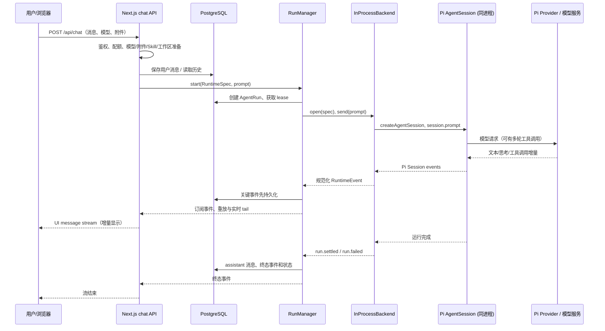
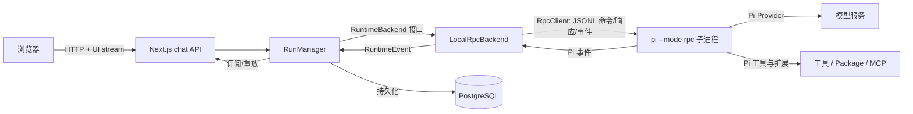

# 聊天业务链路与 RPC 的位置

> 链路核对日期：2026-10-02；Pi 当前版本以依赖文件及 [升级记录](pi-upgrades.md) 为准。本文同时展示**当前生产代码路径**和**已经实现、尚未接入生产组装的本机 RPC 适配器**。完整 Pi 进程 Sandbox / 远端 Worker 是后续目标，见 [目标架构](pi-plugin-support-research.md)。

## 一句话定位

Pi RPC 是**平台运行时与独立 Pi 进程之间的控制和事件协议**。它既不是浏览器的聊天接口，也不是 Pi 向模型供应商发请求的协议。浏览器与平台之间是 HTTP + AI SDK UI message stream；Pi 与模型服务之间由 Pi Provider 负责。当前生产代码甚至还没有跨越 Pi RPC 边界：`RunManager` 固定装配 `InProcessBackend`。

## 当前请求：用户输入到回复

1. `app/(chat)/api/chat/route.ts` 校验输入、用户、权限/配额、可用模型；将用户消息和附件写入相应存储，准备聊天工作区、受管 agentDir 的 MCP `mcp.json`、Skill 提示与工具，把历史转成 Pi 消息。
2. 路由形成 `RuntimeSpec`（模型、提示、历史、工具、工作区）并调用 `RunManager.start()`。`RunManager` 创建 `AgentRun` 与 lease、打开 backend、先启动事件消费，再发送 `prompt`。`prompt` 的受理不等于模型已完成。
3. 当前 `lib/runtime/run/index.ts` 固定选用 `InProcessBackend`。它调用 `lib/ai/agent-session.ts` 创建 Pi `AgentSession`；Pi SDK负责模型请求、Agent loop、工具轮次与扩展事件。模型插件通过 Pi Provider 接入，MCP 由受管 Pi Package 与工作区配置接入。
4. `PiEventNormalizer` 将 Pi 会话事件转为平台 `RuntimeEvent`。`RunManager` 对关键事件分配序号，**先持久化、后广播**，同时保存内存日志供活跃运行的重放。路由的 `stream-mapping.ts` 再将事件转为浏览器消费的 UI message chunk。
5. 运行终态时，`RunManager` 先写最终 assistant 消息，再写终态事件、更新状态并释放 lease。浏览器断开只取消该订阅，运行继续；重连通过 `GET /api/chat/[id]/stream` 附着活跃 run，显式停止通过 `POST /api/chat/[id]/stop`。

## 若改用已有 LocalRpcBackend，RPC 在哪里

`LocalRpcBackend.open()` 启动官方 `RpcClient` 和独立 Pi CLI 子进程；`spawn.ts` 将历史写为 Pi session 文件，构造 `--session`、系统提示、模型、工作目录等参数。`send(prompt)` 通过 RPC 向子进程发命令，子进程经 JSONL 返回**命令响应**及异步的**会话事件**。`RpcClient` 处理进程启动、命令与响应关联、事件订阅和关闭；平台适配器负责转成同一套 `RuntimeEvent`。Pi 官方规定 `prompt` 成功响应只表示命令已受理，真正完成要看 `agent_settled`，所以本适配器据此发出 `run.settled` 或 `run.failed`。

切换 backend 后，`RunManager`、数据库事件、`stream-mapping.ts` 和浏览器不需要理解 Pi RPC 的 JSONL 记录。这就是 `lib/runtime/protocol` 的作用：平台上层仅依赖 `RuntimeBackend`、`RuntimeCommand`、`RuntimeEvent`，Pi SDK 与 Pi RPC 的差别被适配器吸收。

## 三种“流”不要混淆

| 边界 | 方向 | 内容 | 当前状态 |
| --- | --- | --- | --- |
| 浏览器 ↔ Next.js | HTTP 请求 + UI message stream | 用户消息、文本/思考增量、工具状态、游标 | 当前已使用 |
| Next.js/Worker ↔ Pi 进程 | Pi RPC（stdin/stdout JSONL；官方 `RpcClient`） | `prompt`/`abort` 等命令、响应、Pi 会话事件 | `LocalRpcBackend` 已实现并有测试；生产未接入 |
| Pi ↔ 模型服务 | Pi Provider 的模型 API | 提示、模型输出和工具调用内容 | 当前已使用；具体线上协议由 Provider 决定 |

## 当前切换 RPC 的边界

- `lib/runtime/run/index.ts` 与 `lib/runtime/index.ts` 目前都选 `InProcessBackend`；`AgentRun` 创建时也记录 `in_process`。所以不能说线上聊天请求已经经过 RPC。
- `LocalRpcBackend` 已验证 prompt、事件、steer/followUp、abort、进程退出等行为，但 `RuntimeSpec.tools` 内的平台侧工具闭包不能直接跨进程；当前适配器会丢弃这些工具，相关契约测试也按此跳过。要让 RPC 承载完整聊天能力，需要先完成跨进程工具/文件交付桥接。
- 本机子进程隔离不等于目标中的强 Sandbox。目标方案还需 Runtime Worker、完整 Pi 进程隔离、凭据/网络/产物通道与故障处理，并在生产组装点切换 backend。

## Pi 官方依据

- [RPC Mode](https://pi.dev/docs/latest/rpc)：RPC 的进程边界、JSONL 记录、命令响应与 `agent_settled` 终态语义；官方建议 TypeScript 子进程集成使用 `RpcClient`。
- [RPC Commands](https://pi.dev/docs/latest/rpc-commands)：`prompt`、`abort`、`steer`、`follow_up` 等命令契约。
- [SDK](https://pi.dev/docs/latest/sdk)：当前进程内 `createAgentSession()`、`subscribe()`、`prompt()` 和 session 生命周期。
- 具体签名以当前安装的 `node_modules/@earendil-works/pi-coding-agent/dist/modes/rpc/rpc-client.d.ts` 与 `dist/core/sdk.d.ts` 为准。
